# Light ERP 轻量级定制生产流转系统

## 完整使用说明书

| 文档属性 | 内容 |
|---|---|
| 文档名称 | Light ERP 轻量级定制生产流转系统完整使用说明书 |
| 适用版本 | 功能确认版及后续正式部署版本 |
| 文档版本 | V1.0 |
| 编制日期 | 2026 年 8 月 21 日 |
| 适用对象 | 销售、商务内勤、生产、仓库、采购、品控、技术、财务、管理层、系统管理员 |
| 部署方式 | 企业局域网本地部署，可选 VPN 安全访问 |

> 本说明书依据当前系统实际界面和已经实现的业务规则编写。截图中的客户、供应商、物料、金额和单据均为功能确认数据，不代表客户正式经营数据。正式上线后应使用客户确认的主数据、期初库存、权限矩阵和单据编号规则。

---

## 目录

1. [系统定位与适用范围](#1-系统定位与适用范围)
2. [首次使用与登录](#2-首次使用与登录)
3. [岗位角色与权限](#3-岗位角色与权限)
4. [界面通用操作](#4-界面通用操作)
5. [系统核心业务流程](#5-系统核心业务流程)
6. [经营总览](#6-经营总览)
7. [流程驾驶舱](#7-流程驾驶舱)
8. [主数据管理](#8-主数据管理)
9. [销售订单](#9-销售订单)
10. [生产执行](#10-生产执行)
11. [采购仓储](#11-采购仓储)
12. [质检收率](#12-质检收率)
13. [财务台账](#13-财务台账)
14. [报表中心](#14-报表中心)
15. [审批算价](#15-审批算价)
16. [本地归档](#16-本地归档)
17. [系统管理](#17-系统管理)
18. [平行账套](#18-平行账套)
19. [标准业务操作手册](#19-标准业务操作手册)
20. [核心计算与控制规则](#20-核心计算与控制规则)
21. [日常检查清单](#21-日常检查清单)
22. [常见问题与处理](#22-常见问题与处理)
23. [正式上线注意事项](#23-正式上线注意事项)
24. [截图索引](#24-截图索引)

---

## 1. 系统定位与适用范围

Light ERP 是围绕“客户订单交付”建设的本地化生产流转系统。系统以订单为主线，把报价、生产、采购、仓储、质检、财务和经营分析连接为一条可追踪的业务链。

### 1.1 系统主要解决的问题

| 传统工作方式 | 系统化处理方式 |
|---|---|
| 报价、BOM、库存和成本分散在不同 Excel | 使用统一主数据和业务单据，按权限集中维护 |
| 订单下达后靠口头或群消息跟进 | 从客户订单生成生产指令，状态持续更新 |
| 领料数量依赖人工计算 | 根据生产数量和多级 BOM 自动展开需求 |
| 仓库批次选择缺少规则 | 默认 FIFO，可按权限选择批次或替代料 |
| 采购入库后成本需要手工重算 | 自动更新库存数量、批次和成本口径 |
| 不合格批次可能绕过检验入库 | 只有合格或让步接收才能进入成品入库 |
| 应收、应付与业务交付脱节 | 发货生成应收，采购入库生成应付 |
| 管理层需要临时向各部门要报表 | 看板、日报、周报、月报和对账报表统一输出 |
| 数据放在个人电脑或公网云端 | 数据库、附件和备份统一存放在企业指定数据盘 |
| 业务纠错可能影响正在运行的正式数据 | 通过平行账套进行隔离测算、影响分析和正式纠错发布 |

### 1.2 系统不替代的工作

1. 系统记录人工排产结果，但首期不代替生产主管进行复杂自动排产决策。
2. 系统提供财务业务台账和导出，不代替法定财务核算软件。
3. 系统可以生成用友、金蝶所需的基础数据文件，但当前版本不直接连接其数据库。
4. 系统提供轻量 OA 审批，不代替大型综合办公平台的复杂流程引擎。
5. 平行账套是调整测算和正式纠错工具，不用于两个账套同时开展日常经营业务。

---

## 2. 首次使用与登录

### 2.1 访问系统

在企业局域网内使用浏览器访问管理员提供的地址，例如：

```text
http://服务器地址:3010
```

当前本机功能确认地址为：

```text
http://localhost:3010
```

建议使用最新版 Chrome、Edge 或其他 Chromium 内核浏览器。浏览器缩放建议保持 100%。

### 2.2 登录界面

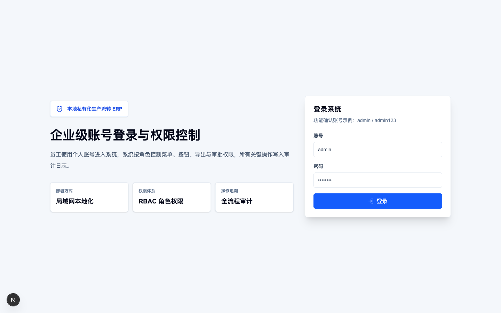

登录步骤：

1. 在“账号”输入框填写个人账号。
2. 在“密码”输入框填写密码。
3. 点击“登录”。
4. 系统校验账号状态、密码和会话后进入经营总览。
5. 登录后顶部会显示当前姓名、角色和账号。

### 2.3 当前功能确认账号

> 以下账号仅用于功能确认环境。正式上线必须删除默认密码或强制所有用户首次登录修改密码。

| 岗位 | 账号 | 初始密码 | 主要职责 |
|---|---|---|---|
| 销售员 | `sales` | `sales123` | 报价与客户订单 |
| 商务内勤 | `assistant` | `assist123` | 生产指令、交付与发货 |
| 生产主管 | `production` | `prod123` | 排产、领料、日报、请验 |
| 仓库管理员 | `warehouse` | `wh123` | 发料、签收、出入库、盘点 |
| 品控员 | `quality` | `qa123` | IQC、OQC、检验判定 |
| 技术部 | `technical` | `tech123` | 不合格原因分析与技术处置 |
| 采购员 | `purchasing` | `pur123` | 供应商、采购、合同、到货 |
| 管理层 | `manager` | `mgr123` | 看板、报表、审批、平行账套 |
| 财务专员 | `finance` | `fin123` | 应收应付、收付款、导出 |
| 系统管理员 | `admin` | `admin123` | 用户、权限、参数、备份与归档 |

### 2.4 退出登录

完成工作后点击页面右上角“退出登录”。多人共用电脑时必须退出，不应只关闭浏览器标签页。

### 2.5 修改密码

1. 登录系统。
2. 进入“系统管理”。
3. 找到“修改本人密码”。
4. 输入原密码、新密码和确认密码。
5. 提交后使用新密码重新登录。

密码不得通过聊天群公开发送。管理员重置密码后，应由用户本人立即修改。

---

## 3. 岗位角色与权限

### 3.1 权限原则

系统采用 RBAC 角色权限控制，并结合具体单据状态进行二次校验。

- 有菜单查看权限，不代表可以执行全部按钮。
- 有业务角色权限，仍需满足单据当前状态。
- 审批申请人不能审批自己提交的平行账套发布申请。
- 只有合格或让步接收的检验批次才能入库。
- 已完成、已冲销、已作废的单据不能重复执行原动作。
- 导出、备份、系统参数和权限配置可独立授权。

### 3.2 岗位职责建议

| 岗位 | 日常入口 | 建议授权范围 |
|---|---|---|
| 销售员 | 经营总览、销售订单 | 客户查询、报价创建、报价确认、订单转换 |
| 商务内勤 | 销售订单、生产执行 | 订单交付信息、生产指令、发货、对账资料 |
| 生产主管 | 生产执行、质检收率 | 排产、领料申请、生产日报、完工请验 |
| 仓库管理员 | 生产执行、采购仓储、质检收率 | 到货签收、FIFO 发料、盘点、原料及成品入库 |
| 采购员 | 采购仓储 | MRP 转申请、采购单、合同、供应商、到货跟进 |
| 品控员 | 质检收率 | IQC、OQC、实测数据、最终判定 |
| 技术部 | 质检收率 | 不合格原因、返工/返修/报废等技术处置 |
| 财务专员 | 财务台账、报表中心 | 回款、付款、退款、台账和财务数据导出 |
| 管理层 | 经营总览、报表中心、平行账套 | 全局查看、关键审批、测算和发布决策 |
| 系统管理员 | 系统管理、本地归档 | 账号、权限、参数、备份、恢复和运行检查 |

### 3.3 操作留痕

正式业务操作会记录操作人、时间、业务对象和动作摘要。业务纠错应通过作废、冲销、退货、盘点调整或正式纠错单完成，不直接修改数据库文件。

---

## 4. 界面通用操作

### 4.1 页面结构

系统桌面端由四部分组成：

1. 左侧导航：切换经营总览和各业务模块。
2. 顶部信息栏：显示当前模块、登录用户和系统同步状态。
3. 模块标题区：说明当前页面处理的业务范围。
4. 内容区：指标、表单、页签、业务表格、待办和图表。

### 4.2 状态标识

常见颜色含义：

| 颜色 | 一般含义 |
|---|---|
| 绿色 | 已完成、已通过、已入库、已结清 |
| 蓝色 | 执行中、已下达、待后续处理 |
| 黄色 | 草稿、待确认、待审批、临期 |
| 红色 | 不合格、逾期、缺料、异常、阻断 |
| 灰色 | 已归档、已作废、只读或无数据 |

具体是否可继续操作，以按钮状态和系统提示为准。

### 4.3 表格操作

- 横向字段较多时，在表格内部横向滚动。
- 点击“详情”“预览”“进入”等按钮查看单据完整信息。
- 状态列用于判断下一步动作，不建议只凭单号判断进度。
- 空状态显示“暂无数据”时，先确认筛选条件、账号权限和上游单据是否已经生成。

### 4.4 表单操作

1. 先选择关联对象，例如客户、产品、订单、生产工单或供应商。
2. 填写数量、日期、价格和备注。
3. 对多明细单据逐行检查物料、数量、单位和单价。
4. 点击保存或提交后等待“数据已同步”。
5. 不要连续快速点击同一提交按钮。

### 4.5 下载、预览与打印

- “下载”通常生成 XLSX、CSV 或正式单据文件。
- “打印预览”打开适合 A4 打印的正式版式。
- 浏览器打印时选择 A4、默认边距或系统推荐边距。
- 下载后的文件应保存到公司规定目录，不应长期放在个人下载目录。

### 4.6 待办与预警

- 待办表示当前用户需要执行的业务动作。
- 预警表示业务风险，不一定等于待审批。
- 点击“已读”只改变阅读状态，不代表风险已经处理。
- 点击“忽略”前应填写或确认忽略依据。
- 可直接处理的预警会提供“登记回款”“调整排产”“登记处置”等按钮。

---

## 5. 系统核心业务流程

### 5.1 销售到回款主线

```text
客户/产品/BOM准备
    → 新建报价
    → 客户确认报价
    → 转正式客户订单
    → 下发生产指令
    → 排产并生成领料单
    → 仓库发料
    → 生产日报与完工请验
    → 品控判定
    → 成品/过渡料入库
    → 商务安排发货
    → 成品库存扣减
    → 自动生成应收
    → 财务登记回款
```

### 5.2 采购到付款主线

```text
库存预警或 MRP 缺口
    → 采购申请
    → 审批/转采购订单
    → 采购合同与供应商下单
    → 到货通知
    → 仓库签收
    → IQC 来料检验
    → 合格入库或不合格处置
    → 更新库存批次和成本
    → 自动生成应付
    → 财务登记付款
```

### 5.3 质量异常闭环

```text
来料或成品检验不合格
    → 登记不合格原因
    → 技术部出具处置意见
    → 返工/返修/复检/退货/报废
    → 品控复检
    → 合格后入库，仍不合格则继续处置
```

### 5.4 正式纠错主线

```text
发现正式数据问题
    → 判断使用作废、冲销、退货、盘点调整或平行账套
    → 在隔离环境测算影响
    → 识别库存、采购、生产、成本缺口
    → 冻结方案并预览发布冲突
    → 提交审批
    → 发布正式纠错单据包
    → 各责任部门执行纠错单
```

---

## 6. 经营总览

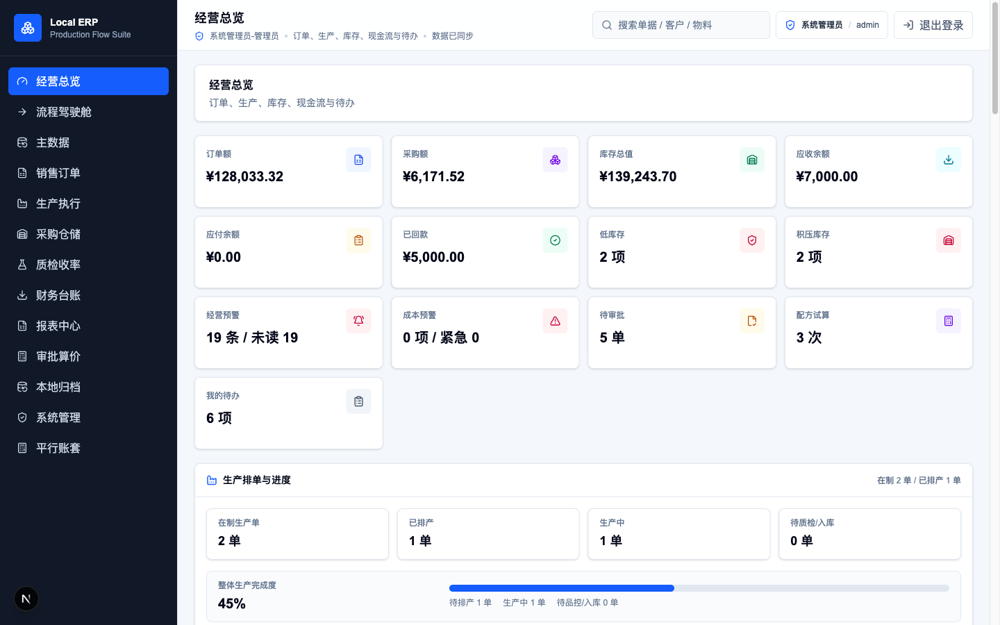

### 6.1 页面用途

经营总览是登录后的默认首页，用于快速判断公司当前经营、交付、库存和资金情况。

### 6.2 主要指标

| 指标 | 说明 |
|---|---|
| 订单额 | 当前统计范围内的销售订单金额 |
| 采购额 | 当前采购订单金额 |
| 库存总值 | 当前物料库存数量乘成本后的汇总 |
| 应收余额 | 未收客户款项余额 |
| 应付余额 | 未付供应商款项余额 |
| 已回款 | 已登记客户回款金额 |
| 低库存 | 低于安全库存或补货点的物料数量 |
| 积压库存 | 达到积压阈值的库存数量 |
| 经营预警 | 当前预警总数和未读数 |
| 成本预警 | 成本异常及紧急数量 |
| 待审批 | 当前待处理审批单数 |
| 配方试算 | 已执行配方试算次数 |
| 我的待办 | 当前登录用户待办数量 |

### 6.3 生产排单与进度

页面展示在制生产单、已排产、生产中、待质检/入库和整体完成度。点击业务模块处理具体工单，不在总览页面直接修改生产数据。

### 6.4 建议使用方式

管理层每天先看总览，再进入异常对应模块。业务人员优先处理“我的待办”，不要只看总体指标。

---

## 7. 流程驾驶舱

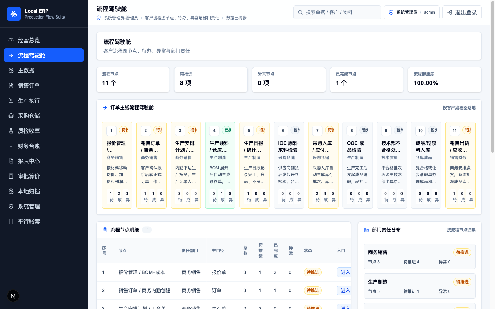

### 7.1 页面用途

流程驾驶舱把客户业务流程图转换为系统节点，展示每个节点的责任部门、待推进数量、异常数量和完成情况。

### 7.2 操作方法

1. 查看顶部流程健康度和异常数量。
2. 在订单主线节点中找到红色或黄色节点。
3. 点击节点进入对应业务模块。
4. 在“待推进与异常关注”查看具体需要处理的业务。
5. 处理完成后返回驾驶舱确认节点数量更新。

### 7.3 使用建议

流程驾驶舱适合晨会、周例会和跨部门交付会议使用，不用于替代各模块的正式单据录入。

---

## 8. 主数据管理

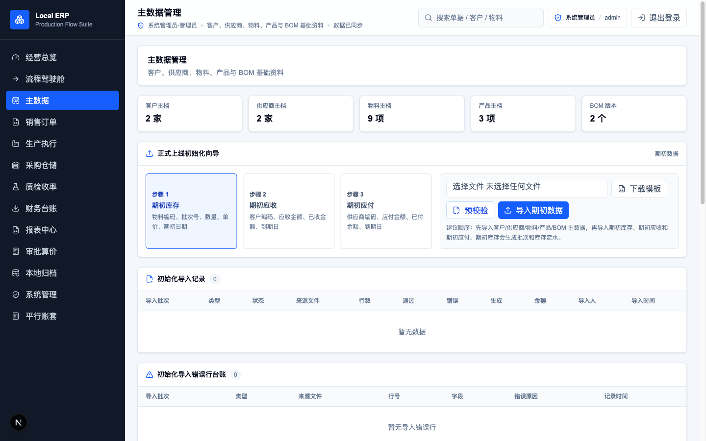

### 8.1 主数据范围

| 主档 | 主要内容 |
|---|---|
| 客户 | 客户编码、名称、联系人、电话、地址、结算信息 |
| 供应商 | 供应商编码、名称、联系人、账期、准入状态 |
| 物料 | 物料编码、名称、规格、单位、类别、安全库存、成本 |
| 产品 | 产品编码、名称、规格、单位、加工费等 |
| BOM | 产品版本、多级组成、单位用量、主材标识、替代关系 |

### 8.2 新增主档

1. 进入“主数据”。
2. 选择客户、供应商、物料、产品或 BOM 页签。
3. 点击新增按钮。
4. 填写唯一编码和必填字段。
5. 保存后在台账中确认状态为“启用”。

编码一经用于正式业务，不建议修改。确需变更时应新增版本或停用旧档。

### 8.3 BOM 版本

1. 先建立产品和所有组成物料。
2. 新建 BOM 版本并选择父产品。
3. 逐行选择物料或下级产品。
4. 填写单位用量和是否主材。
5. 检查是否存在循环引用。
6. 启用新版本，并按制度停用不再使用的旧版本。

系统支持多级 BOM 展开，并会阻止循环 BOM。

### 8.4 主数据导入

1. 下载或使用系统要求的模板。
2. 保持字段名称、编码格式和单位一致。
3. 先在小批量文件中验证。
4. 上传后查看导入结果和错误行台账。
5. 修正错误行后重新导入。

不要在同一个文件中重复使用相同编码表达不同对象。

### 8.5 正式上线初始化

初始化向导用于导入期初库存、期初应收和期初应付。正式导入前应完成：

- 财务、仓库和业务负责人共同确认截止日期。
- 关闭旧系统或明确数据冻结时点。
- 对库存数量、批次、单价和金额进行复核。
- 保存原始导入文件和签字确认版本。

---

## 9. 销售订单

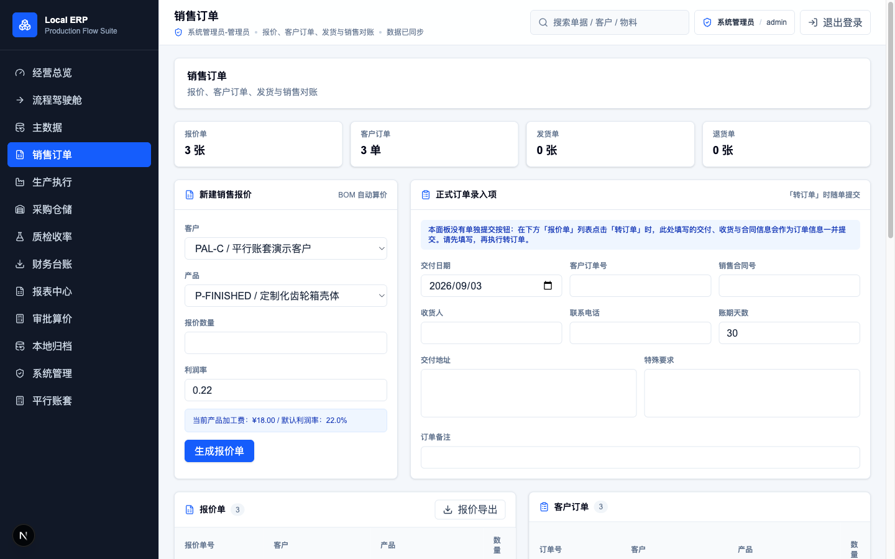

### 9.1 新建报价

1. 进入“销售订单”。
2. 在“新建销售报价”选择客户和产品。
3. 输入报价数量、利润率和必要备注。
4. 系统读取当前 BOM、材料成本和加工费计算报价。
5. 保存后生成报价单号和版本号。
6. 通过预览或导出向客户发送报价单。

报价基础信息发生变化时应创建新版本，不建议覆盖已经发给客户的版本。

### 9.2 确认报价并转订单

1. 客户确认后，在报价单行点击“确认”。
2. 填写交付期限、客户订单号、特殊要求等正式订单信息。
3. 点击“转订单”。
4. 系统生成客户订单，并保持与原报价的关联。

只有符合当前状态的报价才能转订单，重复点击不会生成第二张相同订单。

### 9.3 发货

发货前必须满足：

- 订单已经形成可发货业务对象。
- 对应成品已经通过质检并入库。
- 成品库存数量足够。
- 发货数量不超过订单可发数量。

操作步骤：

1. 在“正式发货单录入”选择待发订单或生产单。
2. 输入发货日期、数量、物流公司、车牌/运单号和收货信息。
3. 提交生成发货单。
4. 系统按成品批次扣减库存并记录成本分摊。
5. 系统生成对应应收账款。
6. 下载送货单或销售对账单。

### 9.4 销售退货

1. 在“销售退货登记”选择原发货单。
2. 填写退货数量、原因和处置方式。
3. 确认是退货入库、待检、报废或其他处理。
4. 系统调整可退数量、库存和应收关系。
5. 需要退款时由财务在“财务台账”登记。

### 9.5 补开发货单

补发必须关联原退货或原发货业务，系统不会重复生成原销售应收。提交前确认补发原因、数量和物流信息。

---

## 10. 生产执行

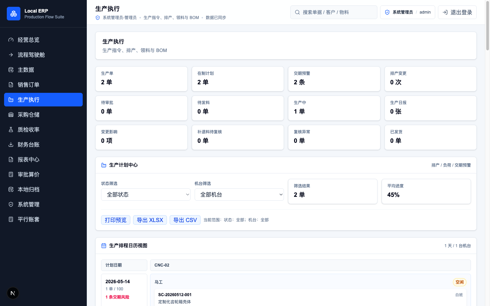

### 10.1 下发生产指令

1. 商务内勤进入“生产执行”。
2. 在待下发订单中选择客户订单。
3. 填写优先级、生产说明和技术要求。
4. 提交后生成生产指令/生产工单。

### 10.2 排产并生成领料单

1. 生产主管选择待排产生产单。
2. 输入计划日期、机台、班次、负责人和排产说明。
3. 输入或确认生产数量。
4. 系统按启用 BOM 自动展开原料需求。
5. 系统生成领料单明细。
6. 如库存不足，系统显示缺口并进入采购/MRP处理。

### 10.3 生产计划日历与锁版

生产排程日历用于查看日期、机台和生产负荷。重要计划可以执行锁版：

1. 确认计划日期、负责人和机台。
2. 点击锁版并提交审批。
3. 审批通过后发布计划版本。
4. 发布后的变更形成变更记录和相关岗位通知。

### 10.4 计划变更影响

计划日期或数量改变后，系统会检查：

- 领料和补退料需求。
- 采购到货窗口。
- 质检窗口。
- 客户交付时间。
- 工单成本和生产资源。

责任人应逐项处理影响，不应只修改日期后结束流程。

### 10.5 仓库发料

1. 仓库管理员查看待审批领料单。
2. 核对生产工单、物料和需求量。
3. 批准领料后选择“FIFO 发料”。
4. 系统优先分配最早入库且有可用量的批次。
5. 特殊质量或客户要求时，可按权限手动选择批次或替代料。
6. 确认后扣减批次和库存，并形成库存流水。

手动批次和替代料应填写原因。

### 10.6 补料与退料

计划或生产实际发生变化时：

1. 系统或生产人员生成补退料建议。
2. 生产确认建议并转正式补料/退料单。
3. 仓库执行实际收发。
4. 财务或授权人员复核成本影响。
5. 存在差异时生成异常处理任务。
6. 成本调整按规则进入审批或红冲流程。

### 10.7 生产日报

生产人员按日填写产量、工时、损耗、异常和备注。日报用于生产进度、收率、成本和异常分析，不应在完工后一次性倒填全部日期。

### 10.8 完工请验

实际生产完成后，在“质检收率”或生产待办中发起请验。未完成领料、生产日报或必要状态时，系统可能阻止请验。

---

## 11. 采购仓储

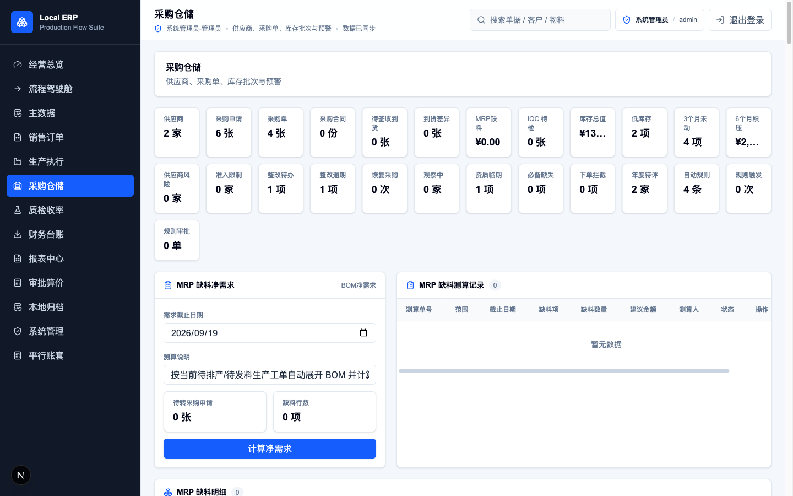

### 11.1 MRP 缺料测算

1. 进入“采购仓储”。
2. 选择需求范围或执行 MRP 净需求计算。
3. 系统汇总 BOM 需求、安全库存、当前库存、在途采购和已申请数量。
4. 查看净缺口和建议采购数量。
5. 对需要采购的明细生成采购申请。

### 11.2 采购申请

采购申请用于“提出需要”，采购订单用于“向供应商正式下单”。

1. 选择供应商或先保留待询价状态。
2. 添加多条物料明细。
3. 填写数量、预计单价、需求日期和申请原因。
4. 提交审批。
5. 审批后转采购订单。

### 11.3 采购订单

1. 选择已准入供应商。
2. 添加采购物料、数量、单价和税务/交付信息。
3. 核对总金额和到货日期。
4. 保存采购订单。
5. 根据审批规则提交审批。

供应商处于限制采购或黑名单状态时，系统会阻止新增采购订单。

### 11.4 采购合同与供应商下单

1. 从采购订单生成采购合同记录。
2. 填写合同号、付款条件、交付约定和备注。
3. 上传合同附件。
4. 标记供应商下单时间和经办人。
5. 在合同台账中预览或导出正式版式。

### 11.5 到货通知与仓库签收

1. 采购收到供应商发货信息后创建到货通知。
2. 填写预计到货日期、车辆/物流、物料和数量。
3. 仓库到货时核对实收数量和包装状态。
4. 登记仓库签收。
5. 数量或质量外观不一致时创建到货差异单。

到货通知变更会保留变更前后内容和原因。

### 11.6 IQC 来料检验

仓库签收不等于采购入库。需要检验的物料必须经过 IQC：

1. 对已签收到货创建 IQC 请检。
2. 品控录入检验项目、实测结果和结论。
3. 合格或按规则让步接收的物料进入采购入库。
4. 不合格物料进入退货、降价、补料、换货或技术处理。

### 11.7 采购入库

1. 选择通过 IQC 的采购到货记录。
2. 核对实际入库数量、批次号、日期和单价。
3. 提交后生成采购入库单和原料批次。
4. 系统更新物料库存和成本。
5. 系统生成供应商应付账款。

### 11.8 库存盘点

1. 创建盘点单并选择物料或批次范围。
2. 录入实盘数量。
3. 系统计算账实差异和金额影响。
4. 提交审批。
5. 审批通过后生成正式调整流水。

盘点不得直接覆盖原库存记录。

### 11.9 库龄预警和积压库存

- 连续 3 个月未发生变动的库存进入预警。
- 连续 6 个月未发生变动的库存纳入积压报表。
- 阈值由系统参数控制，正式上线以客户确认值为准。
- 仓库应登记处置负责人、计划、结果和附件。

### 11.10 供应商全生命周期

采购仓储模块还包括：

- 供应商绩效评分。
- 准入规则和限制状态。
- 整改、复评、黑名单和恢复采购。
- 恢复采购后的观察期。
- 年度复评。
- 资质证书、附件、到期提醒和续证。
- 必备资质矩阵和缺失检查。

采购前应先查看供应商准入状态和必备资质是否完整。

---

## 12. 质检收率

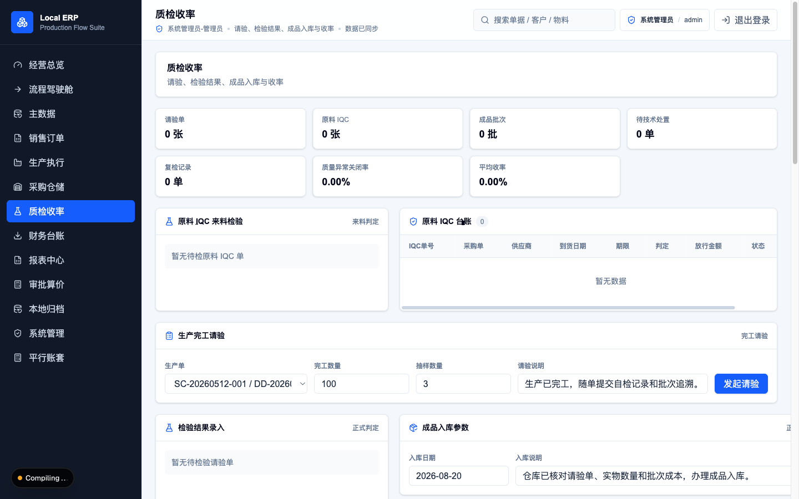

### 12.1 检验结果

系统支持三类最终判定：

| 判定 | 后续处理 |
|---|---|
| 合格 | 允许入库 |
| 让步接收 | 经授权后允许入库，并保留让步依据 |
| 不合格 | 不允许入库，进入技术处置或退换货流程 |

### 12.2 生产完工请验

1. 生产主管选择已完工生产单。
2. 填写请验数量、批次和说明。
3. 提交生成请验单。
4. 品控员待办出现检验任务。

### 12.3 OQC 检验判定

1. 品控员选择待检请验单。
2. 录入实测数据、合格数量和检验说明。
3. 选择合格、让步接收或不合格。
4. 提交后更新生产单和待入库状态。

### 12.4 技术处置与复检

不合格时：

1. 技术部查看不合格原因和实测数据。
2. 选择返工、返修、挑选、报废、降级或其他处置。
3. 填写原因分析、措施、责任人和期限。
4. 需要复检时生成下一轮检验任务。
5. 品控重新判定。
6. 复检合格后关闭技术处置；仍不合格则继续处理。

### 12.5 成品和过渡料入库

1. 仓库选择合格或让步接收的检验单。
2. 填写成品实际入库量。
3. 记录过渡料、边角料或其他副产物数量。
4. 确认批次和库位。
5. 系统生成成品入库单、批次和工单成本归集。

### 12.6 收率

系统以实际合格/让步入库量与主材实际领料量计算收率，并同时展示计划完成率。异常收率会进入质量或经营预警。

---

## 13. 财务台账

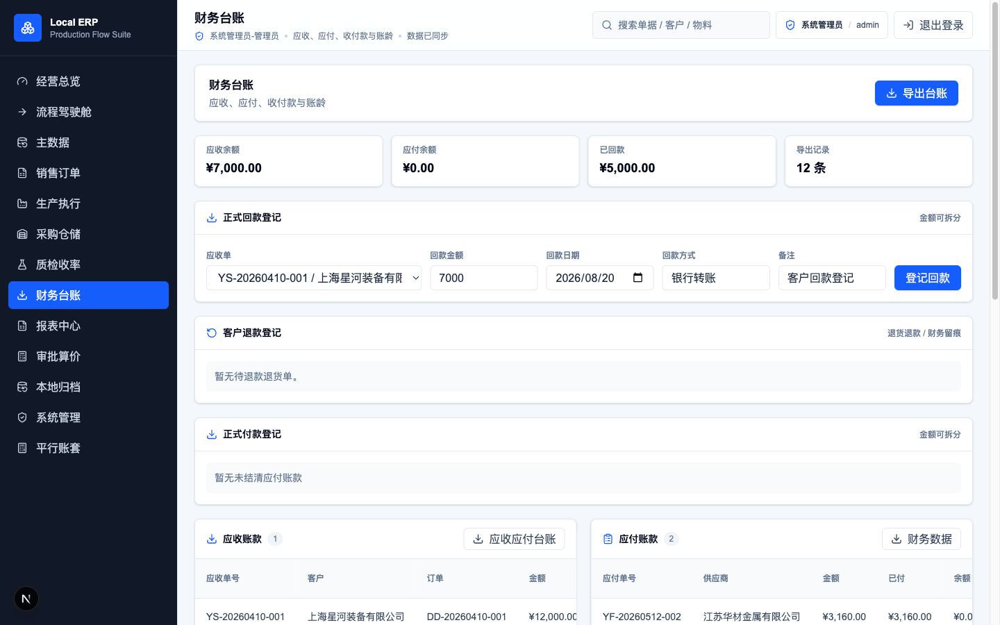

### 13.1 应收账款

发货完成后自动生成应收。财务可查看客户、订单、发货单、总额、已收、余额、到期日和账龄。

### 13.2 登记回款

1. 选择应收单。
2. 输入本次回款金额、日期、方式和备注。
3. 可上传银行回单或收款凭证。
4. 保存后系统更新已收金额、余额和状态。

状态规则：未收为“未收”，部分回款为“部分”，余额归零为“已收/已结清”。

### 13.3 应付账款与付款

采购入库后自动生成应付：

1. 选择供应商应付单。
2. 输入本次付款金额、日期和方式。
3. 核对采购订单、入库单和发票/合同资料。
4. 保存后更新已付金额、余额和状态。

### 13.4 客户退款

客户退款必须关联销售退货或其他正式退款依据。登记后保留退款金额、方式、日期和凭证。

### 13.5 冲销和红冲

发现错误时不要删除收付款记录，应通过系统管理中的正式冲销功能生成反向业务流水和应收/应付红冲记录。

---

## 14. 报表中心

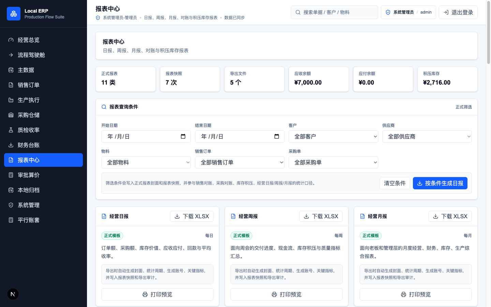

### 14.1 报表范围

系统当前支持日报、周报、月报、库存积压、销售对账、采购对账、应收应付、库存明细、质量和成本异常等报表。

### 14.2 查询和导出

1. 选择开始日期和结束日期。
2. 按需要选择订单、客户、供应商或物料条件。
3. 点击查询刷新报表摘要。
4. 先使用打印预览确认口径。
5. 点击下载生成 XLSX/CSV 文件。
6. 系统记录导出人、导出时间、类型和文件位置。

### 14.3 报表快照

日报、周报、月报可生成快照。快照用于保留某个时点的报表结果，避免后续业务变化导致历史会议材料无法复核。

### 14.4 成本异常分析

成本异常报表支持下钻到生产工单、审批记录、红冲记录和整改任务。处理步骤：

1. 查看异常金额和等级。
2. 打开工单下钻明细。
3. 核对领退料、加工费、损耗和成本调整。
4. 创建整改任务并指定责任人。
5. 责任人提交结果。
6. 复核通过后关闭。

---

## 15. 审批算价

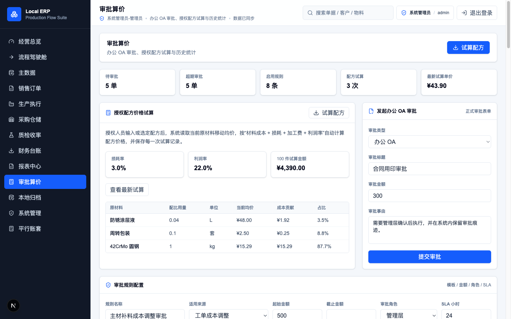

### 15.1 授权配方试算

配方试算只向授权人员开放：

1. 新建试算并填写名称、用途和目标产量。
2. 从系统物料中选择组成原料。
3. 输入每种原料用量或比例。
4. 系统读取当前成本并计算材料总价。
5. 输入加工费、损耗率、利润率等授权参数。
6. 保存试算结果和版本。

试算不会直接修改产品 BOM、采购订单或正式库存。

### 15.2 办公 OA 审批

系统支持简单办公审批：

1. 选择审批类型。
2. 填写标题、事由、金额、申请日期和附件。
3. 提交后按规则进入指定角色待办。
4. 审批人同意或驳回并填写意见。
5. 申请人查看最终状态。

### 15.3 审批规则

管理员可以配置业务类型、金额阈值、审批角色、SLA 和是否启用。规则修改后应先预览影响，再正式生效。

### 15.4 预警订阅

管理员可按角色设置接收哪些预警、最低等级以及是否进入待办。订阅配置只控制通知路由，不改变业务规则本身。

---

## 16. 本地归档

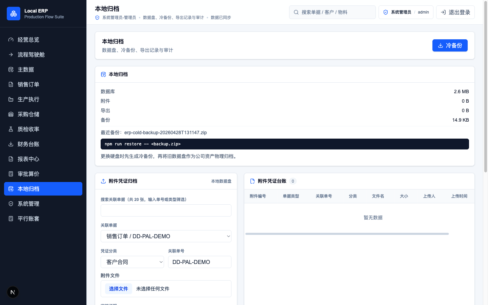

### 16.1 附件归档

系统支持将合同、检验报告、签收单、回款凭证、整改附件等文件关联到具体业务单据。

上传时必须选择正确的单据类型和单据号。文件进入企业数据盘，不应以个人电脑目录作为正式归档位置。

### 16.2 冷备份

管理员点击“生成备份包”后，系统打包：

- SQLite 数据库。
- 上传附件。
- 导出文件。
- 备份清单 manifest。

备份完成后应将备份包复制到另一块受控硬盘或企业备份介质。

### 16.3 恢复

恢复前必须停止正在运行的系统，并备份当前数据目录。标准命令：

```bash
npm run restore -- <backup.zip>
```

恢复完成后重新启动系统，并核对数据库、附件、用户登录和关键单据。

### 16.4 数据盘

系统数据目录可通过环境变量指定：

```bash
ERP_DATA_DIR=/企业指定数据盘/LightERP
```

数据库和附件应放在企业专用数据盘，应用程序与经营数据分开存放。

---

## 17. 系统管理

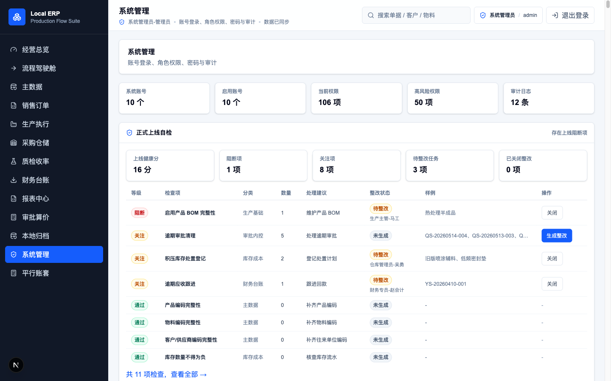

### 17.1 正式上线自检

上线自检检查主数据、BOM、库存、账号、权限、参数、备份和异常事项。未通过项目可以生成整改任务。

### 17.2 整改闭环

1. 创建整改任务。
2. 指定责任角色、责任人和到期日。
3. 责任人提交整改结果和附件。
4. 复核人通过或驳回。
5. 通过后关闭任务，驳回后重新整改。

### 17.3 系统参数

系统参数包括库存预警天数、积压天数、收率预警线、账款提醒、审批阈值和备份策略等。

修改参数前使用“影响预览”查看受影响的库存、账款、收率和审批单据。保存后系统记录变更前值、变更后值、操作人和生效时间。

### 17.4 单据作废与冲销

- 作废适用于尚未产生不可逆下游影响的错误单据。
- 冲销适用于已经形成库存、成本或账款影响的单据。
- 冲销会生成反向库存流水和财务红冲记录。
- 已冲销单据不能再次按原路径执行。

### 17.5 用户管理

管理员可以：

- 新增用户。
- 修改姓名、岗位和角色。
- 启用或停用账号。
- 重置密码。
- 查看最近登录情况。

人员离职时应停用账号，不应删除其历史业务记录。

### 17.6 权限矩阵

1. 选择角色和业务动作。
2. 查看当前是否启用。
3. 填写变更原因。
4. 保存后立即生效。
5. 使用对应角色账号验证菜单和按钮。

权限变更应遵循最小权限原则，生产、仓库、财务和审批岗位应尽量职责分离。

### 17.7 审计与登录日志

登录日志用于查看账号登录时间和结果；审计日志用于查询业务动作、对象和操作人。发现异常登录时，应立即停用账号、修改密码并检查业务日志。

---

## 18. 平行账套

### 18.1 功能定位

平行账套是在正式经营数据之外建立的隔离测算工作区。它可以独立保存、反复调整和比较，也可以在确认后将差异转换为正式纠错单据发布到原经营账套。

平行账套不会被普通员工当作另一套日常业务系统使用，也不会在未审批时直接覆盖正式数据。

### 18.2 账套列表

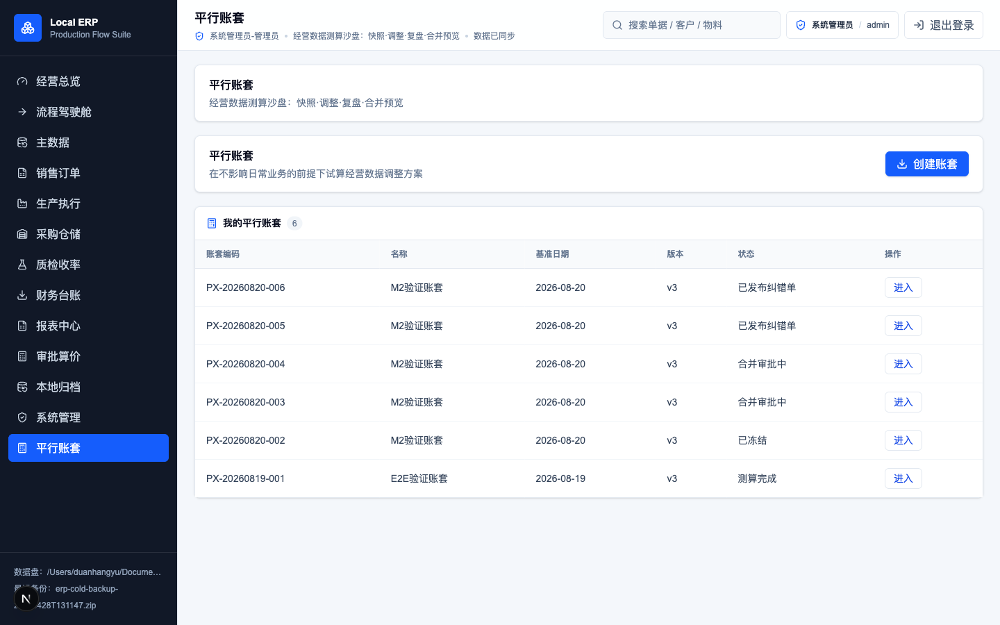

列表显示账套编码、名称、基准日期、版本和状态。只有管理层、财务或管理员等授权角色可以看到该模块。

### 18.3 创建平行账套

1. 点击“创建账套”。
2. 填写名称、用途和基准日期。
3. 选择范围：公司、生产工单、订单、产品或物料。
4. 非公司范围必须选择具体业务对象。
5. 选择“仅测算”或“允许申请合并”。
6. 创建后系统从正式账套提取范围内快照。

范围快照会自动关联必要的订单、产品、BOM、物料、批次、领料和成本数据。

### 18.4 测算总览

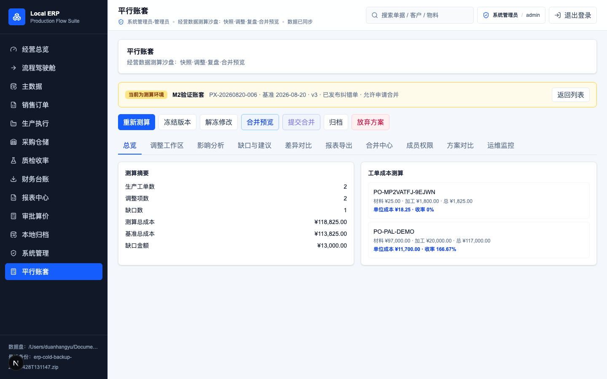

总览显示生产工单数、调整项数、缺口数、基准成本、测算成本、缺口金额、单位成本和收率。

### 18.5 调整工作区

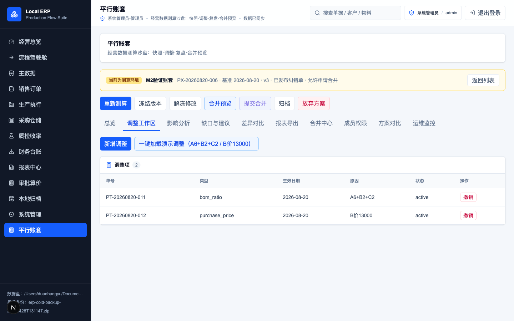

当前支持的调整类型：

| 调整类型 | 主要用途 |
|---|---|
| 配方比例调整 | 修改产品对某原料的单位用量 |
| 采购价格调整 | 测算原料采购价格变化 |
| 采购数量调整 | 增加或减少计划采购量 |
| 物料替换 | 将原料 A 替换为原料 B |
| 库存数量调整 | 测算物料总体库存变化 |
| 批次数量调整 | 调整具体批次可用数量 |
| 工单领料调整 | 修改某工单某物料实际/计划领料量 |
| 工单产量调整 | 修改某生产工单测算产量 |
| 加工费/损耗调整 | 修改加工费或损耗率 |
| 生效日期调整 | 记录方案计划生效日期 |

录入调整时必须填写原因，并选择范围内的合法业务对象。

### 18.6 重新测算

点击“重新测算”后，系统会：

1. 递归展开多级 BOM。
2. 按多个工单顺序共享和占用同一库存批次池。
3. 按 FIFO 分配现有批次。
4. 计算库存不足和建议采购。
5. 计算工单材料成本、加工成本、总成本和单位成本。
6. 计算库存投影和收率。
7. 生成影响分析、缺口和建议单据。

### 18.7 缺口与建议

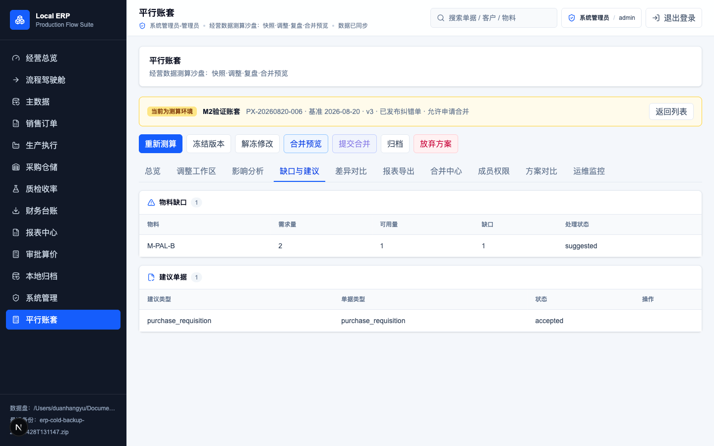

如果将原料 A 替换为 B，而 B 库存不足，系统会展示 B 的需求量、可用量、缺口和建议采购量。授权人员可以接受建议，将其纳入发布单据包。

有未处理的阻断缺口时，系统不允许提交发布。

### 18.8 冻结和发布预览

完成调整后：

1. 点击“冻结版本”，防止审批期间继续修改。
2. 点击“合并预览”，比较基准快照与当前正式数据。
3. 查看是否存在同一业务对象已经被正式业务修改的冲突。
4. 存在冲突时，不得强行覆盖。
5. 点击“吸收正式变更并重新基线”后重新测算。

### 18.9 合并中心

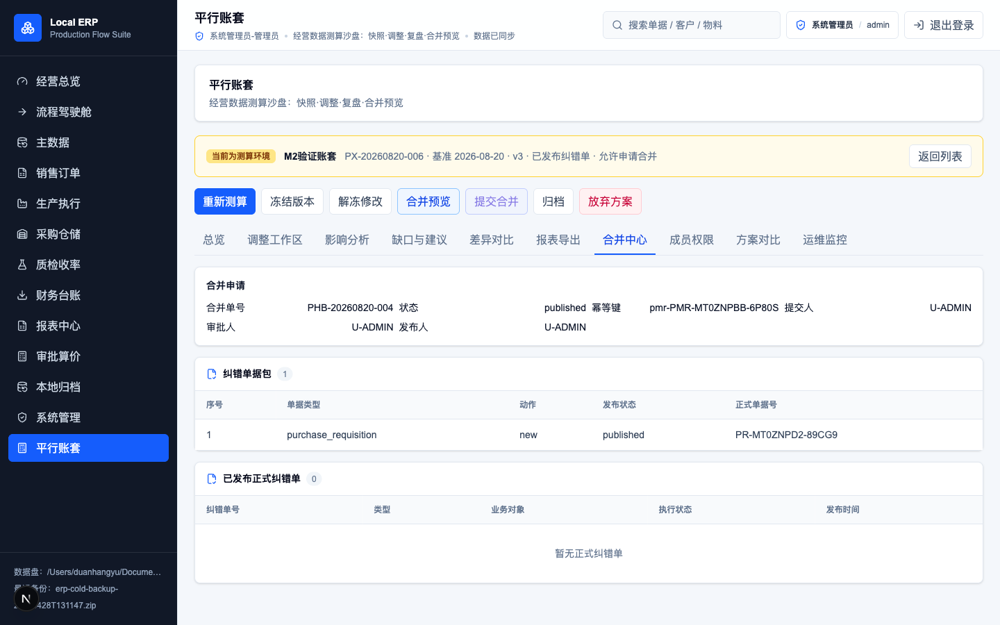

界面仍使用“合并”表示将确认差异发布回正式经营体系。实际发布原则是：

- 不直接静默覆盖正式数据库。
- 接受的采购缺口生成正式采购申请。
- 其他调整生成正式纠错单。
- 正式纠错单保留业务对象、调整类型、来源账套和执行状态。
- 责任部门按正式纠错单完成实际业务调整。

发布步骤：

1. 冻结账套。
2. 完成冲突预览。
3. 处理所有阻断缺口。
4. 点击“提交合并”。
5. 非申请人审批同意。
6. 有发布权限的人员点击“发布到正式账套”。
7. 在纠错单据包和正式业务模块检查生成结果。

### 18.10 成员权限

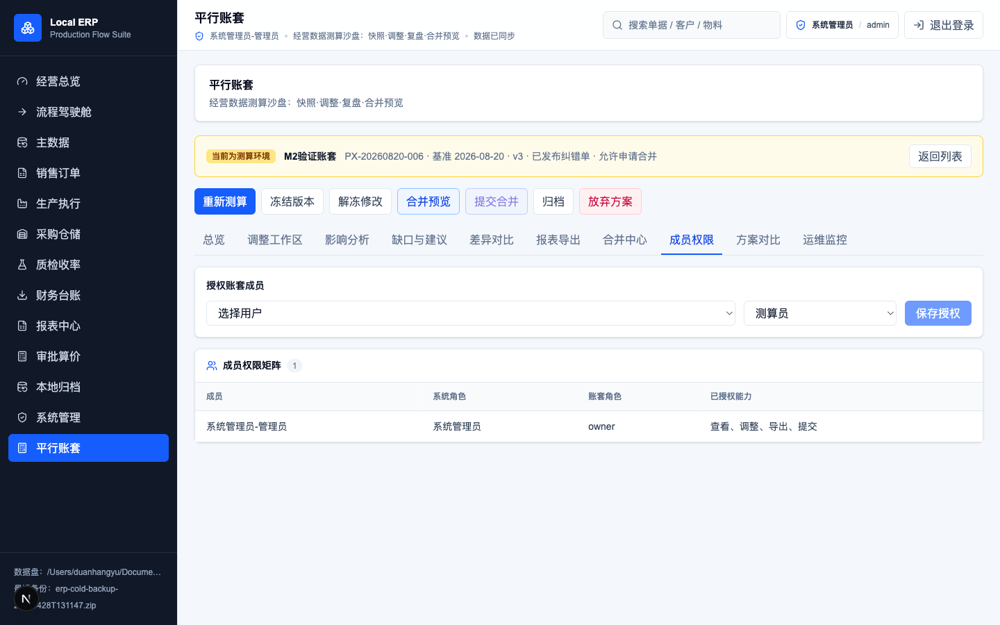

账套内角色：

| 账套角色 | 能力 |
|---|---|
| 观察员 | 查看账套和结果 |
| 测算员 | 录入调整、重算、冻结、提交 |
| 审批人 | 审核发布申请 |
| 发布人 | 将批准方案发布为正式单据 |
| 账套管理员 | 管理成员、归档和放弃方案 |

系统级角色权限和平行账套成员权限必须同时满足。

### 18.11 运维监控

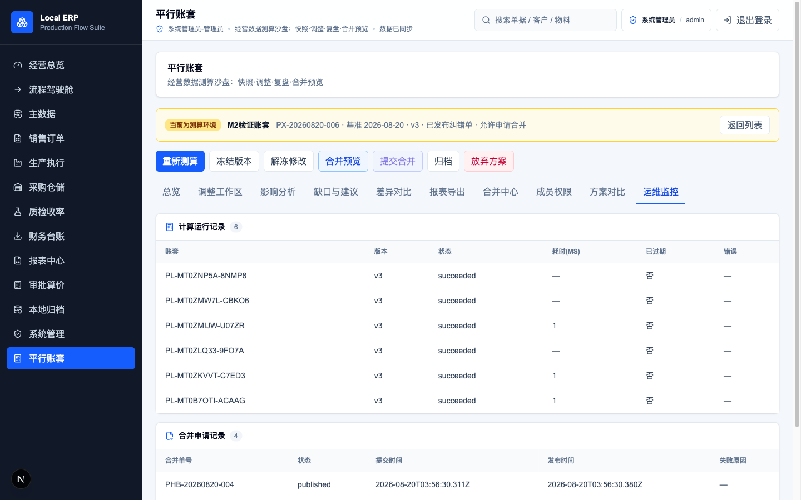

运维监控显示计算版本、耗时、状态、是否过期、错误信息和发布申请记录。计算失败时先查看错误，不要直接重复提交发布。

### 18.12 平行账套状态

| 状态 | 含义 |
|---|---|
| 草稿 | 可以录入调整 |
| 计算中 | 正在执行测算 |
| 测算完成 | 已生成结果，可继续调整或冻结 |
| 已冻结 | 调整暂时锁定，可进行发布预览 |
| 合并审批中 | 已提交审批 |
| 合并已驳回 | 需要修改或放弃 |
| 存在冲突 | 正式数据已变化，需要重新基线 |
| 已发布纠错单 | 差异已生成正式业务单据 |
| 已归档 | 保留历史，只读 |
| 已放弃 | 方案不再使用 |

### 18.13 使用边界

- “仅测算”账套无法提交合并。
- 申请人不能审批自己的发布申请。
- 平行账套发布后仍需检查正式纠错单执行状态。
- 不应将平行账套文件作为未经授权的对外正式报表。
- 不应绕过系统直接修改数据库快照或计算结果。

---

## 19. 标准业务操作手册

### 19.1 新客户订单完整操作

| 步骤 | 责任岗位 | 操作模块 | 完成标志 |
|---|---|---|---|
| 1 | 销售 | 主数据 | 客户、产品、BOM 可用 |
| 2 | 销售 | 销售订单 | 报价单生成 |
| 3 | 销售 | 销售订单 | 报价确认并转订单 |
| 4 | 商务内勤 | 生产执行 | 生产指令生成 |
| 5 | 生产 | 生产执行 | 排产和领料单生成 |
| 6 | 仓库 | 生产执行 | 原材料按批次发出 |
| 7 | 生产 | 生产执行 | 日报完成并发起请验 |
| 8 | 品控 | 质检收率 | 检验合格或让步接收 |
| 9 | 仓库 | 质检收率 | 成品入库完成 |
| 10 | 商务内勤 | 销售订单 | 发货单和送货单生成 |
| 11 | 系统 | 财务台账 | 应收自动生成 |
| 12 | 财务 | 财务台账 | 回款登记并结清 |

### 19.2 新采购完整操作

| 步骤 | 责任岗位 | 操作模块 | 完成标志 |
|---|---|---|---|
| 1 | 采购 | 采购仓储 | 缺口或采购需求确认 |
| 2 | 采购 | 采购仓储 | 采购申请提交 |
| 3 | 审批人 | 审批算价 | 审批通过 |
| 4 | 采购 | 采购仓储 | 采购订单生成 |
| 5 | 采购 | 采购仓储 | 合同和供应商下单完成 |
| 6 | 采购 | 采购仓储 | 到货通知创建 |
| 7 | 仓库 | 采购仓储 | 实物签收完成 |
| 8 | 品控 | 质检收率 | IQC 判定完成 |
| 9 | 仓库 | 采购仓储 | 采购入库完成 |
| 10 | 系统 | 财务台账 | 应付自动生成 |
| 11 | 财务 | 财务台账 | 付款登记并结清 |

### 19.3 数据错误纠正选择

| 场景 | 推荐方式 |
|---|---|
| 草稿单据字段填写错误 | 返回草稿修改 |
| 未产生下游影响的错误正式单据 | 按权限作废后重建 |
| 已产生库存或账款影响 | 正式冲销并重建 |
| 实物与账面库存不一致 | 库存盘点调整 |
| 客户退回已发货产品 | 销售退货/退款/补发 |
| 供应商到货数量差异 | 到货差异处理 |
| 跨采购、生产、库存和成本的复杂调整 | 平行账套测算后发布纠错单 |

---

## 20. 核心计算与控制规则

### 20.1 多级 BOM

系统递归展开产品、半成品和原料，并按生产数量聚合相同物料需求。发现循环引用时停止计算并提示错误。

### 20.2 FIFO 批次分配

仓库默认从最早入库且仍有可用量的批次开始发料。手动选择批次或替代料属于例外操作，应有权限和原因。

### 20.3 库存成本

- 采购入库按当前库存金额和新入库金额更新成本。
- 发料和出库按实际批次记录数量及成本影响。
- 剩余库存成本可根据剩余批次重新归集。
- 冲销生成反向库存流水，不删除原流水。

### 20.4 收率

```text
收率 = 实际合格/让步入库量 ÷ 主材实际领料量 × 100%
```

主材由 BOM 标识。没有主材实际领料量时，收率为 0，不能凭空估算。

### 20.5 应收应付状态

```text
余额 = 应收/应付总额 - 已收/已付金额
```

余额为总额时是未收/未付；余额大于 0 且发生过收付款时是部分；余额为 0 时已结清。

### 20.6 库龄

系统根据最后一次库存变动时间计算未动天数。默认业务要求为 90 天预警、180 天纳入积压报表，正式值由系统参数决定。

### 20.7 配方试算

系统按配方中各原料用量和当前成本计算材料金额，再按配置加入加工费、损耗和利润参数。试算结果不自动成为正式 BOM。

---

## 21. 日常检查清单

### 21.1 销售和商务内勤

- 检查待确认报价和待转订单。
- 检查临近交期订单。
- 检查成品入库后待发货订单。
- 检查送货单、客户签收和应收生成情况。

### 21.2 生产主管

- 检查未排产工单和机台负荷。
- 检查待领料、缺料和替代料事项。
- 每日填报生产日报。
- 完工后及时发起请验。
- 处理计划变更通知和补退料影响。

### 21.3 仓库管理员

- 检查待签收、待发料、待入库任务。
- 核对批次、数量和实物状态。
- 检查低库存、90 天预警和 180 天积压。
- 检查待审批盘点差异和处置任务。

### 21.4 采购员

- 检查 MRP 缺口和低库存。
- 检查待审批采购申请和待下单采购单。
- 跟进合同、到货通知和逾期到货。
- 检查供应商资质、准入状态和观察期。

### 21.5 品控和技术部

- 检查待 IQC、待 OQC 和待复检任务。
- 及时录入实测数据和判定依据。
- 跟踪不合格技术处置和到期整改。
- 检查收率和不合格原因趋势。

### 21.6 财务

- 检查临期、逾期应收应付。
- 登记当日回款、付款和退款。
- 核对业务单据、金额和凭证。
- 导出财务明细并完成对账。

### 21.7 系统管理员

- 检查备份是否成功。
- 检查磁盘空间和附件容量。
- 检查异常登录、失败操作和审计日志。
- 处理人员入离职账号和权限。
- 定期执行恢复演练，而不只确认备份文件存在。

---

## 22. 常见问题与处理

### 22.1 登录提示账号或密码错误

确认账号拼写、大小写和账号状态。连续失败时联系管理员重置密码，不要多人反复尝试同一账号。

### 22.2 登录后看不到操作按钮

可能原因：角色没有权限、权限矩阵未启用、单据状态不允许、当前用户不是责任人。先查看页面状态，再联系管理员确认权限。

### 22.3 报价无法转订单

确认报价是否已经客户确认、是否已转过订单，以及客户、产品和交期信息是否完整。

### 22.4 排产后没有领料单

确认产品是否有启用 BOM、BOM 是否包含有效明细、生产数量是否大于 0。循环 BOM 或缺失物料会阻止生成。

### 22.5 仓库无法发料

确认领料单是否已批准、库存批次是否足够、选择数量是否等于需求量。替代料必须已配置或有相应权限。

### 22.6 成品无法入库

确认品控结果是否为合格或让步接收。不合格批次必须先完成技术处置和复检。

### 22.7 发货后没有应收

检查发货单是否正式提交、是否为不产生应收的补发单、金额是否为 0，以及发货是否已被冲销。

### 22.8 采购入库后没有应付

检查采购入库是否完成、入库金额是否有效、是否已经生成过应付或已冲销。

### 22.9 平行账套不能提交合并

常见原因：创建时选择了“仅测算”、账套未冻结、存在阻断缺口、未完成合并预览、正式数据发生冲突，或当前用户没有提交权限。

### 22.10 平行账套提示冲突

表示建立快照后正式经营数据发生了变化。点击“吸收正式变更并重新基线”，检查变化并重新测算，不要强行覆盖。

### 22.11 导出文件找不到

先检查浏览器下载目录，再进入“本地归档”的导出记录查看。正式文件应转存到公司规定目录。

### 22.12 页面数据未更新

等待顶部显示“数据已同步”。仍未更新时刷新浏览器，但不要在未知结果下重复提交业务动作。

---

## 23. 正式上线注意事项

### 23.1 上线前必须确认

1. 公司名称、Logo、税号、地址、电话和正式页脚。
2. 客户、供应商、物料、产品和 BOM 主数据。
3. 单位、数量精度、金额精度和成本口径。
4. 期初库存、批次、应收和应付。
5. 角色、用户、审批人和权限矩阵。
6. 单据编号规则。
7. 库龄、收率、账款和审批阈值。
8. 数据盘、备份盘和恢复负责人。
9. 打印模板和签字栏。
10. 试运行截止时间和旧账冻结时点。

### 23.2 上线建议顺序

```text
主数据确认
  → 期初数据导入
  → 权限和参数确认
  → 典型订单试运行
  → 采购/生产/质量/财务对账
  → 备份恢复演练
  → 正式切换
```

### 23.3 数据安全

- 不将数据库文件上传到个人网盘。
- 不在公网直接暴露应用端口。
- 远程访问使用企业 VPN 或受控访问方案。
- 数据盘、备份盘和归档硬盘建立资产登记。
- 定期验证备份可以恢复。
- 管理员账号不用于日常销售、仓库或财务录单。

---

## 24. 截图索引

| 编号 | 页面 | 文件 |
|---|---|---|
| 01 | 登录页 | `manual-assets/01-login.png` |
| 02 | 经营总览 | `manual-assets/02-overview.png` |
| 03 | 流程驾驶舱 | `manual-assets/03-process-cockpit.png` |
| 04 | 主数据 | `manual-assets/04-master-data.png` |
| 05 | 销售订单 | `manual-assets/05-sales.png` |
| 06 | 生产执行 | `manual-assets/06-production.png` |
| 07 | 采购仓储 | `manual-assets/07-inventory.png` |
| 08 | 质检收率 | `manual-assets/08-quality.png` |
| 09 | 财务台账 | `manual-assets/09-finance.png` |
| 10 | 报表中心 | `manual-assets/10-reports.png` |
| 11 | 审批算价 | `manual-assets/11-approval-formula.png` |
| 12 | 本地归档 | `manual-assets/12-archive.png` |
| 13 | 系统管理 | `manual-assets/13-system.png` |
| 14 | 平行账套列表 | `manual-assets/14-parallel-list.png` |
| 15 | 平行账套总览 | `manual-assets/15-parallel-overview.png` |
| 16 | 平行账套调整 | `manual-assets/16-parallel-adjustments.png` |
| 17 | 平行账套缺口 | `manual-assets/17-parallel-gaps.png` |
| 18 | 平行账套合并中心 | `manual-assets/18-parallel-merge.png` |
| 19 | 平行账套成员权限 | `manual-assets/19-parallel-members.png` |
| 20 | 平行账套运行监控 | `manual-assets/20-parallel-monitoring.png` |

---

## 文档维护说明

系统新增模块、变更状态机、修改打印模板或调整权限后，应同步更新本说明书。正式客户版本应补充公司抬头、项目名称、文档审批页、培训签到和版本修订记录。
