# 轻量级定制生产流转 ERP 功能与技术方案

版本：V1.0  
文档用途：正式项目方案 / 客户采购与技术评审  
适用对象：企业管理层、业务负责人、采购负责人、IT 技术评审、实施团队  
方案定位：本地化部署、围绕销售订单主线的轻量级定制 ERP 系统  

---

## 1. 项目概述

### 1.1 建设背景

客户当前业务并不是缺少管理经验，而是缺少一套真正贴合自身经营流程的数字化工具。现有流程已经非常清晰：销售报价、客户下单、商务内勤下发生产、生产排产、BOM/配方确认、仓库领料出库、生产完工请验、品控判定、成品入库、发货、对账、收付款，最终形成经营日报、周报、月报。

目前这些动作主要依赖人工沟通、Excel 表格、纸质单据和部门之间的线下确认。短期看灵活，长期看会逐渐形成管理上的“看不见、算不准、追不回”：

- 订单走到哪一步，需要靠电话、微信或人工询问。
- 原材料采购价格变化后，库存均价、产品成本、配方价格需要人工重新计算。
- BOM、领料、批次、替代料和收率之间没有完整线上追溯。
- 仓库出入库后，采购、生产、内勤和管理层不能同步看到最新库存、批次成本和动态库存均价。
- 发货之后应收、采购入库之后应付、对账单和送货单容易滞后。
- 经营数据散落在不同人员手中，管理层无法随时看到订单、库存、生产、现金流和收率情况。
- 通用 ERP 模块较重，流程固化，很多功能用不上，反而增加使用成本。
- 客户明确要求系统本地部署，不使用公网云存储，经营数据应作为公司资产保存在本地硬盘中。

因此，本方案建议建设一套轻量级、定制化、本地部署的生产流转 ERP 系统。系统不追求大而全，而是围绕客户真实业务主线，把每天实际发生的单据、库存、成本、质检、收付款和报表统一管理起来。

### 1.2 系统定位

本系统定位为“轻量级定制生产流转 ERP”，不是传统重型 ERP，也不是单纯进销存软件。

它的核心定位包括：

- 以销售订单为主线，贯通销售、内勤、生产、仓库、采购、品控、财务和管理层。
- 以真实业务动作驱动库存、成本、收率、应收应付和报表自动更新。
- 以本地部署和硬盘归档保障客户数据资产的物理私有。
- 以简洁工作台代替复杂菜单，让员工只看到自己需要处理的待办。
- 以可扩展定制架构支持后续按客户实际流程逐步增强。

### 1.3 采购判断结论

从客户需求匹配度、实施可控性、数据安全和长期使用价值看，本项目具备采购建设价值。

建议采购方将本项目作为“本地定制轻量 ERP 建设项目”推进，而不是一次性采购通用 ERP 套件。推荐路径是先交付功能确认版，用于确认业务流程、界面形态、核心算法和单据逻辑；确认通过后导入客户真实基础资料和单据模板，进入小范围试运行；试运行稳定后进入正式上线。

本方案不包含具体商务报价，便于采购方先对功能范围、技术架构、实施可行性和采购价值进行独立评估。

### 1.4 系统界面预览

以下界面为现有 Demo 示例截图，仅用于帮助客户直观理解系统的信息组织方式、模块布局和关键业务能力。该 Demo 示例不等同于项目第一阶段交付的“功能确认版”：功能确认版将在正式项目启动后，结合客户真实基础资料、单据字段、权限范围和报表模板进行整理交付，用于正式确认业务流程和系统边界。

正式上线时，页面名称、客户 Logo、单据字段、报表模板、权限范围、数据库环境和部署配置均以项目实施阶段确认结果为准。

#### 经营总览

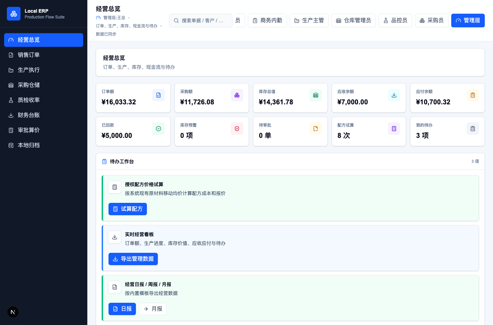

#### 销售订单

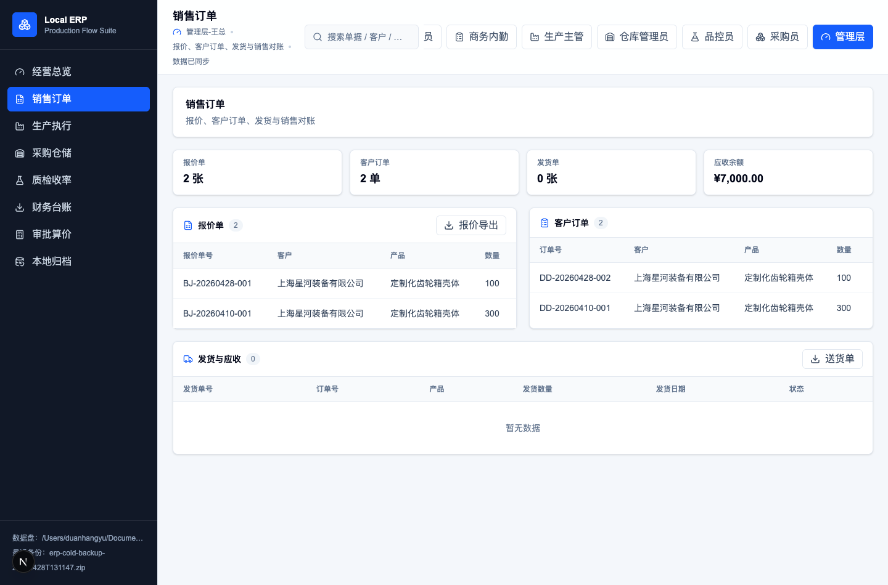

#### 采购仓储

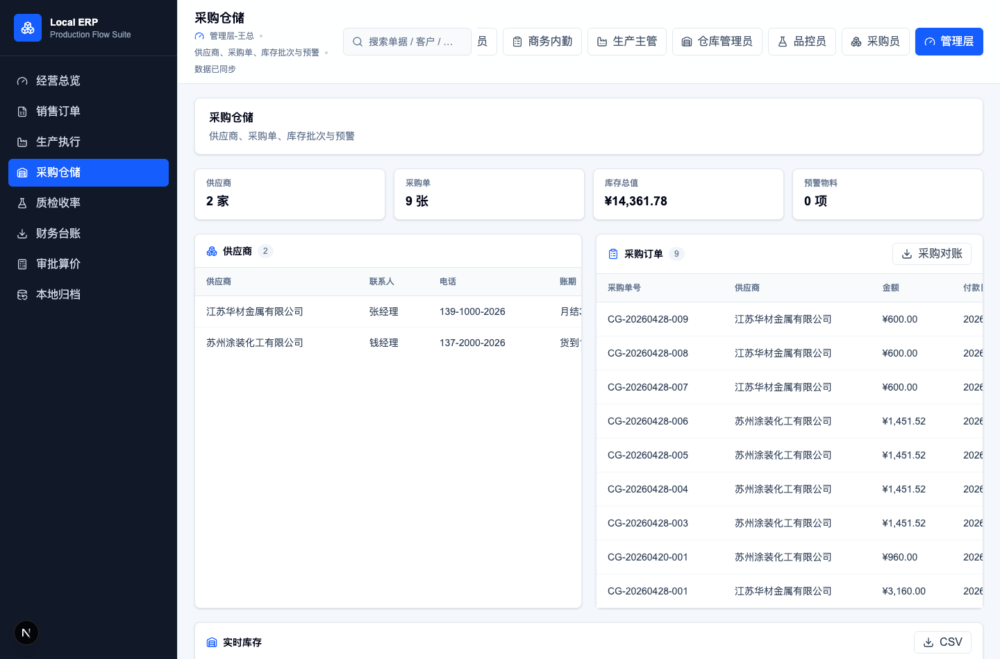

#### OA 审批与配方算价

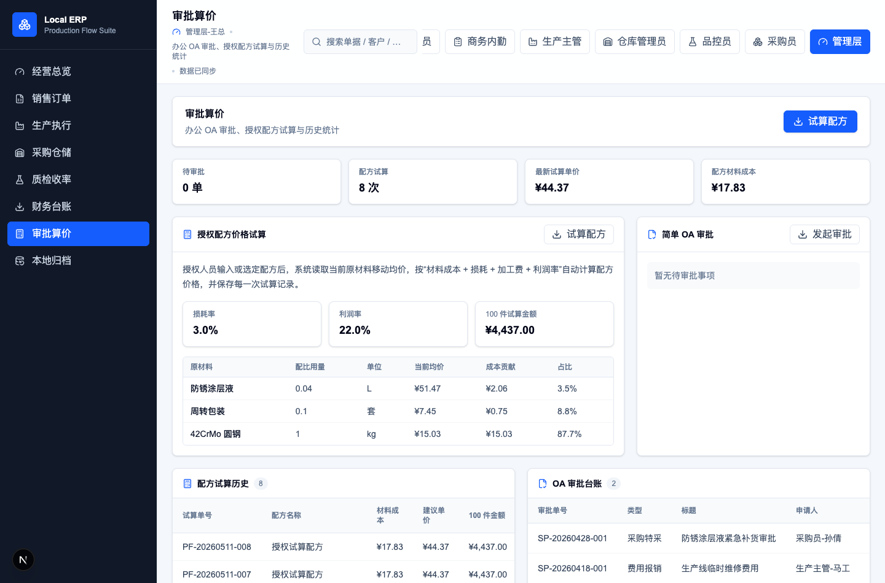

#### 本地归档

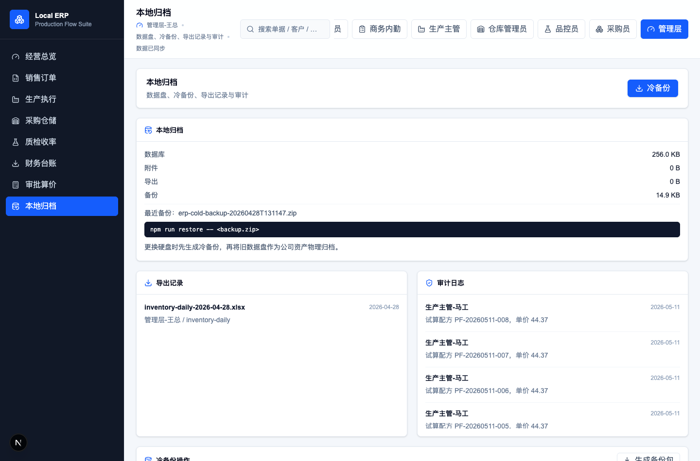

### 1.5 总体能力思维导图

下图从采购评审角度展示系统能力边界。系统并非简单进销存或传统重型 ERP，而是以销售订单为主线，围绕生产、仓储、采购、品控、财务、审批和本地归档构建一套可落地的经营数据闭环。

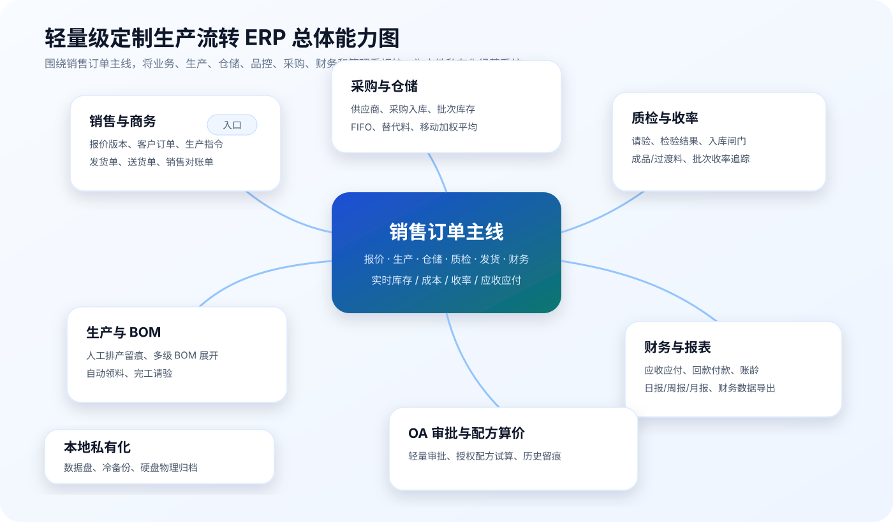

## 2. 业务价值

### 2.1 管理层价值

管理层最关心的不是系统有多少菜单，而是企业经营状态是否能被及时看见。

系统上线后，管理层可以实时查看：

- 当前订单金额和订单进度。
- 生产任务处于哪个阶段。
- 原材料和成品库存价值。
- 哪些物料低于安全库存，哪些库存 3 个月未发生变动，哪些库存 6 个月未发生变动并需要纳入积压报表。
- 应收余额、应付余额和已回款金额。
- 品控结果和生产收率趋势。
- 有多少 OA 审批待处理。
- 授权人员共试算过多少个配方，最近配方成本是多少。

这样管理层不需要反复询问部门负责人，也不需要等月底汇总 Excel，系统本身即可成为经营数据看板。

### 2.2 商务内勤价值

商务内勤在客户流程中是枢纽角色。系统上线后，内勤可以围绕订单完成：

- 查看待下发订单。
- 一键生成生产指令。
- 跟踪生产、质检、入库状态。
- 成品入库后安排发货。
- 生成发货单、送货单、销售对账单。
- 发货后自动形成应收账款。

内勤不再需要在多个群聊和表格之间反复确认订单状态，系统会把每一步进展沉淀为可查看、可追溯的单据。

### 2.3 生产部门价值

生产部门保留人工排产的灵活性，同时把排产证据、BOM、领料和请验纳入系统。

系统上线后，生产部门可以：

- 接收商务下发的生产指令。
- 记录计划生产日期、机台、负责人。
- 维护或导入 BOM/配方。
- 按排产数量自动生成领料单。
- 生产完成后发起请验。
- 查看生产状态和对应订单。

这符合客户“不需要系统自动排产，但必须有排产记录”的真实要求。

### 2.4 仓库价值

仓库部门最需要的是库存准确、批次清楚、出入库有据可查。

系统上线后，仓库可以：

- 根据领料单发料。
- 默认按 FIFO 先进先出分配批次。
- 特殊情况下手动指定批次并填写原因。
- 使用预设替代料发料并保留记录。
- 采购入库后形成新批次。
- 品控放行后办理成品、过渡料、边角料入库。
- 查看实时库存、批次数量、安全库存预警、3 个月未动库存预警和 6 个月未动积压库存报表。

每一次出入库都会同步影响库存、批次、库存价值和动态库存均价。

### 2.5 采购价值

采购部门录入原材料采购价格后，系统不仅记录采购单，还会自动更新库存批次成本和库存均价；仓库出库后，系统也会根据剩余批次库存重新计算当前库存均价。

系统上线后，采购可以：

- 维护供应商台账。
- 根据库存预警生成采购订单。
- 录入采购数量、单价、到货信息。
- 采购入库后自动更新物料批次和移动加权平均成本。
- 仓库出库后按实际出库批次成本扣减库存总成本，并重新计算剩余库存均价。
- 采购入库后自动生成应付账款。
- 查看采购历史价格和供应商应付余额。

采购价格不再只是采购自己的数据，而会成为报价、配方算价、库存价值和经营报表的基础数据。

### 2.6 品控价值

品控部门的核心价值在于为入库提供质量闸门。

系统上线后，品控可以：

- 接收生产请验单。
- 录入检验数据。
- 判定合格、让步接收或不合格。
- 控制是否允许入库。
- 查看历史检验结果和收率趋势。

只有合格或让步接收的批次才能入库，不合格批次不能直接进入仓库环节。

### 2.7 财务价值

系统不直接替代财务软件，也不强制对接用友或金蝶。它承担的是业务侧财务数据提取台。

系统上线后，财务可以：

- 查看应收台账。
- 查看应付台账。
- 登记客户回款。
- 登记供应商付款。
- 查看未收、部分回款、已收状态。
- 查看未付、部分付款、已付状态。
- 按时间段、订单、客户、供应商导出原始明细。

财务需要做账时，可以从系统导出结构化数据，再导入或录入现有财务软件。

## 3. 总体业务流程

### 3.1 订单主线流程

系统以销售订单为唯一主线，所有生产、仓储、质检、财务动作都围绕订单展开。

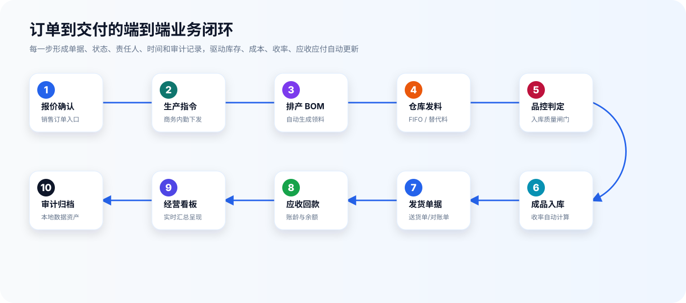

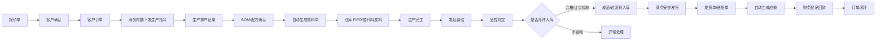

### 3.2 采购与成本支线

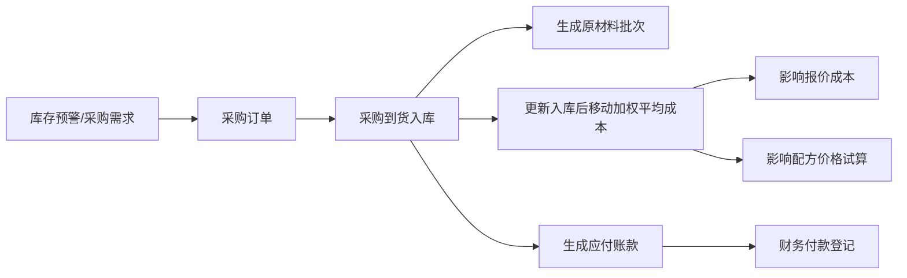

### 3.3 OA 审批与授权算价支线

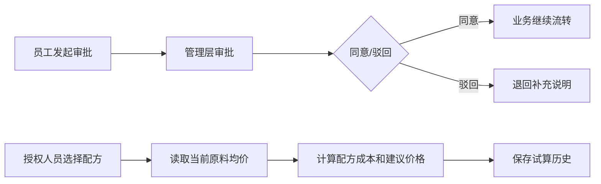

## 4. 功能方案

### 4.1 经营总览

经营总览是管理层和各角色进入系统后的核心首页。

主要能力：

- 展示订单额、采购额、库存价值、应收余额、应付余额、已回款、库存预警、待审批、配方试算次数、个人待办。
- 展示订单流转、生产进度、库存价值、现金流和收率趋势。
- 展示 3 个月未发生变动库存预警、6 个月未发生变动积压库存金额和积压明细入口。
- 按角色显示待办卡片，例如销售确认报价、内勤下发生产、仓库发料、品控检验、财务登记回款。
- 支持从待办直接进入业务处理，减少寻找菜单的时间。

采购评审价值：

- 管理层可以快速判断系统是否真正服务经营管理。
- 员工不需要学习复杂 ERP 菜单，只处理自己岗位相关任务。

### 4.2 销售订单

主要能力：

- 客户资料维护。
- 报价单创建、确认、版本管理和导出。
- 已确认报价转客户订单。
- 客户订单状态跟踪。
- 发货单、送货单、销售对账单导出。

关键规则：

- 报价可依据材料移动均价、加工费、利润率自动计算。
- 报价确认后进入订单流程。
- 发货后自动生成应收账款。

### 4.3 生产执行

主要能力：

- 接收生产指令。
- 人工排产并记录计划生产日期、机台、负责人。
- BOM/配方录入或 Excel 导入。
- 多级 BOM 展开。
- 按排产数量自动生成领料单。
- 生产完成后发起请验。

关键规则：

- 系统不强制自动排产，保留生产现场灵活性。
- 但每张生产单必须有排产记录，形成过程证据。
- 领料单由 BOM 和生产数量自动计算，避免人工 Excel 计算错误。

### 4.4 采购仓储

主要能力：

- 供应商台账。
- 采购订单。
- 采购入库。
- 原材料批次管理。
- FIFO 发料。
- 手动批次调整。
- 替代料发料。
- 成品、过渡料、边角料入库。
- 库存预警和库存日报导出。
- 3 个月未动库存预警。
- 6 个月未动库存纳入积压库存报表。

关键规则：

- 采购入库生成批次。
- 采购入库更新移动加权平均成本。
- 仓库出库按实际扣减批次成本，并重算剩余库存均价。
- 发料默认 FIFO。
- 手动改批次和替代料发料必须留痕。
- 库存不足时禁止出库。
- 同一物料连续 3 个月无入库、出库、盘点调整等库存变动时，系统自动标记为呆滞预警库存。
- 同一物料连续 6 个月无库存变动时，系统自动纳入积压库存报表，展示积压数量、积压金额、最近变动日期和责任部门。

### 4.5 质检收率

主要能力：

- 接收请验单。
- 录入检验结果。
- 判定合格、让步接收、不合格。
- 控制是否允许入库。
- 记录成品批次、过渡料、边角料。
- 自动计算生产收率。

关键规则：

- 合格和让步接收允许入库。
- 不合格不能直接入库。
- 收率按实际合格/让步入库量与主材实际领料量计算。

### 4.6 财务台账

主要能力：

- 发货后自动生成应收账款。
- 采购入库后自动生成应付账款。
- 支持部分回款、部分付款。
- 自动计算余额和状态。
- 查看账龄。
- 导出应收应付台账和财务原始数据。

关键规则：

- 系统不直接替代用友/金蝶。
- 财务需要的数据从本系统导出，保持业务系统和财务系统解耦。

### 4.7 OA 审批

主要能力：

- 发起简单办公审批。
- 支持采购特采、替代料使用、让步接收、费用报销、设备维修、日常办公申请等轻量审批。
- 管理层或管理员可同意、驳回。
- 审批结果进入台账。
- 审批动作写入审计日志。

设计原则：

- 首期不做复杂流程引擎。
- 以固定审批模板和固定审批人为主。
- 重点满足“事项有记录、审批有结论、责任可追溯”。

### 4.8 授权配方算价

这是本系统的重要差异化功能。

主要能力：

- 授权人员选择系统已有原材料并输入组成配比。
- 系统读取每种原材料当前移动加权平均成本。
- 按公式自动计算配方材料成本、损耗成本、加工费、利润和建议价格。
- 保存每一次试算记录。
- 统计累计试算次数。
- 展示每次试算的原材料组成、当时均价、成本贡献、试算人和试算时间。

业务价值：

- 替代人工 Excel 查价和算价。
- 采购价格变化后，配方价格可立即重新计算。
- 历史试算保留当时价格，便于解释报价依据。
- 只有授权人员可试算，避免敏感成本扩散。

### 4.9 报表导出

主要能力：

- 报价单导出。
- 送货单导出。
- 销售对账单导出。
- 采购对账单导出。
- 应收应付台账导出。
- 库存日报导出。
- 呆滞库存预警报表导出。
- 积压库存报表导出。
- 经营周报、经营月报导出。
- 财务原始数据导出。

正式上线可增强：

- 公司 Logo。
- 报表抬头和页脚。
- 制表人、审核人。
- 客户固定 Excel 模板填充。

### 4.10 本地归档

主要能力：

- 展示当前数据盘路径。
- 展示数据库大小、附件大小、导出文件大小、备份包大小。
- 展示最近备份包。
- 一键生成冷备份。
- 提供恢复命令。
- 支持后续硬盘物理归档。

客户价值：

- 数据资产不进入公网云。
- 经营数据可随硬盘作为企业资产封存。
- 更换硬盘时有恢复路径。

### 4.11 系统管理

主要能力：

- 用户管理。
- 角色权限配置。
- 基础资料配置。
- 单据编号规则。
- 审计日志查看。
- 备份恢复管理。
- 系统参数配置。

首期可采用预置角色和固定权限，正式上线阶段再根据客户组织架构完善权限后台。

## 5. 核心算法说明

### 5.1 动态库存均价与批次成本

系统采用“批次成本记录 + 动态库存均价”的成本模型。每次采购入库后，系统自动更新原材料移动加权平均成本；每次仓库出库后，系统按照实际出库批次成本扣减库存总成本，并根据剩余库存重新计算当前库存均价。

采购入库后的均价计算：

```text
新库存均价 = (原库存数量 × 原库存均价 + 本次入库数量 × 本次采购单价)
          ÷ (原库存数量 + 本次入库数量)
```

仓库出库后的均价计算：

```text
本次出库成本 = Σ(出库批次数量 × 对应批次单位成本)

出库后库存均价 = (出库前库存总成本 - 本次出库成本)
              ÷ (出库前库存数量 - 本次出库数量)
```

规则：

- 采购入库增加库存数量、生成新批次并更新库存均价。
- 仓库出库减少库存数量和批次数量，同时根据剩余批次成本重算库存均价。
- 出库成本按实际发料批次计算；默认 FIFO 出库时，优先扣减最早入库批次成本。
- 手动改批次或使用替代料时，系统按实际选择的批次成本计算出库成本，并保留操作原因。
- 当某物料库存数量归零时，该物料不再参与库存价值计算；系统可保留最近一次采购价或最后一次有效均价作为后续报价和配方试算的参考价。
- 物料当前均价用于报价、库存价值、配方算价和管理报表。

### 5.2 BOM 多级展开

系统支持产品 BOM 中包含半成品或多层结构。生成领料单时，系统会递归展开多级 BOM，并把最终原材料需求合并。

示例：

```text
成品 A
  - 半成品 B
      - 原材料 1
      - 原材料 2
  - 包装材料 3
```

系统最终会计算原材料 1、原材料 2、包装材料 3 的总需求量。

### 5.3 FIFO 批次出库

仓库发料时，系统默认按最早入库批次分配库存。

规则：

- 按入库时间从早到晚扣减。
- 一个批次数量不足时，自动继续扣减下一批。
- 每次分配记录批次、数量、单位成本和来源领料单。
- 若总库存不足，系统提示缺口并禁止发料。
- 出库完成后，系统按实际扣减批次成本重新计算该物料剩余库存均价。

### 5.4 替代料发料

当客户允许某些原材料互相替代时，可在系统中预设替代关系。

规则：

- 替代料必须来自预设替代关系。
- 替代料发料需要记录是否替代。
- 正式上线建议要求填写替代原因和审批记录。
- 替代料使用记录进入审计日志。

### 5.5 生产收率

生产完成并经品控放行后，系统根据实际入库量和主材实际领料量计算收率。

```text
收率 = 实际合格/让步入库量 ÷ 主材实际领料量 × 100%
```

系统同时保留：

- 实际入库数量。
- 主材实际领料数量。
- 过渡料/边角料数量。
- 生产批次。
- 收率趋势。

### 5.6 配方价格试算公式

授权人员进行配方试算时，系统读取当前原材料移动加权平均成本。

```text
单个配方材料成本 = Σ(原材料配比用量 × 当前移动加权平均成本)
含损耗材料成本 = 单个配方材料成本 × (1 + 损耗率)
配方成本 = 含损耗材料成本 + 加工费
建议销售单价 = 配方成本 × (1 + 利润率)
批量试算金额 = 建议销售单价 × 试算数量
```

关键点：

- 当前试算使用当前均价。
- 历史试算保留当时均价，不随未来采购价格变化改写。
- 采购入库改变均价后，再试算同一配方会得到新价格。
- 仓库出库导致剩余库存均价变化后，再试算同一配方也会读取新的当前均价。

### 5.7 呆滞库存与积压库存识别

系统按物料或库存批次记录最近一次库存变动日期。库存变动包括采购入库、生产领料出库、成品入库、盘点调整、退料、报废、调拨等会影响库存数量或库存成本的动作。

规则：

- 连续 3 个月未发生库存变动的物料或批次，系统标记为“呆滞预警库存”。
- 连续 6 个月未发生库存变动的物料或批次，系统标记为“积压库存”，并纳入积压库存报表。
- 积压库存报表展示物料名称、批次号、库存数量、当前库存均价、积压金额、最近变动日期、库龄天数、所属仓库和责任部门。
- 管理层可在经营总览中查看积压库存金额和积压数量，仓库与采购可按报表进行处理建议跟踪。
- 积压库存不自动报废、不自动调价，系统只提供识别、预警、统计和导出，最终处理由企业内部审批决定。

## 6. 技术架构方案

### 6.1 总体架构

系统采用本地单体 Web 应用架构，适合客户内部小团队、低并发、高私有化要求的场景。

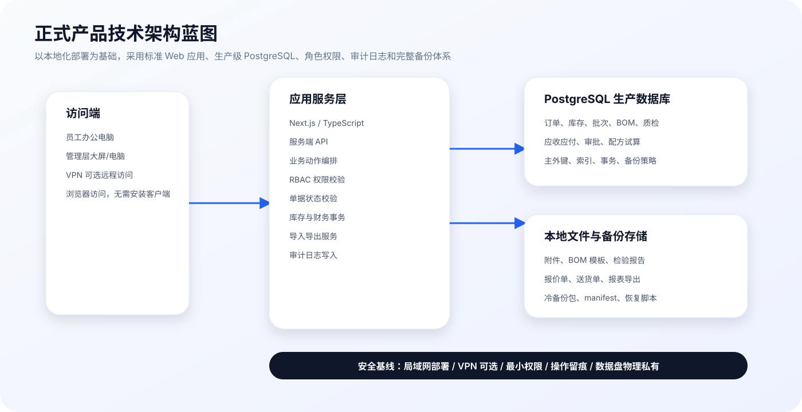

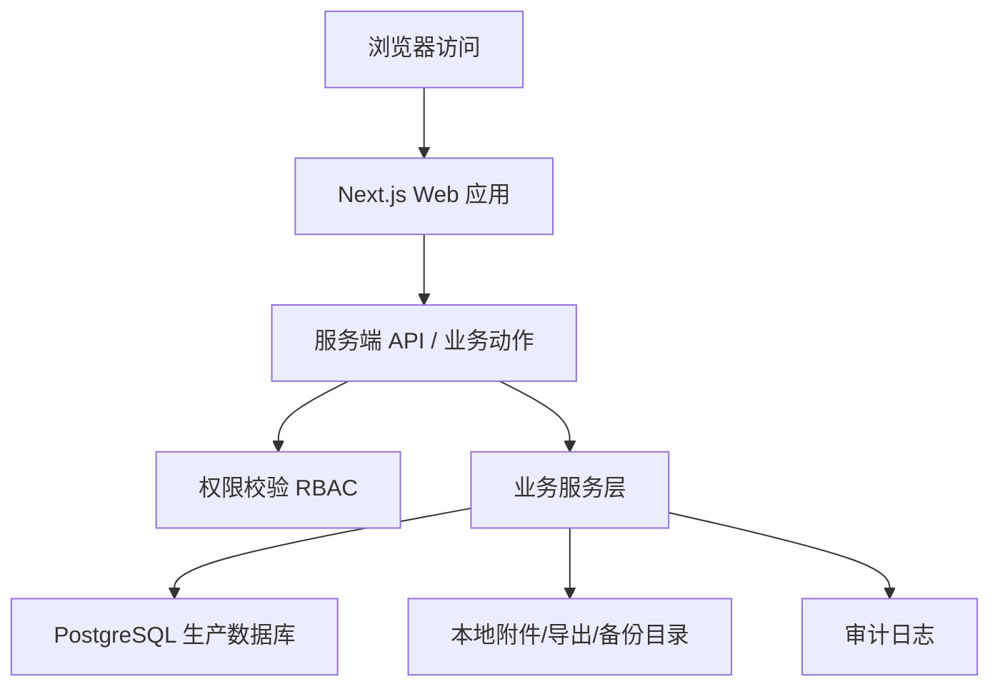

### 6.2 前端方案

技术选型：

- Next.js App Router。
- TypeScript。
- Tailwind CSS。
- Recharts 图表。
- lucide-react 图标。

界面原则：

- 左侧模块导航。
- 登录后进入角色工作台。
- 待办事项卡片优先。
- 模块页面采用“指标 + 表格 + 操作按钮”的商用 ERP 风格。
- 移动端可浏览，但主要使用场景为办公电脑和管理大屏。

### 6.3 后端方案

后端采用 Next.js 服务端 API，所有写操作通过服务端接口完成。

关键能力：

- 角色权限校验。
- 单据状态校验。
- 库存校验。
- 事务写入。
- 审计日志。
- 文件导出。
- 备份恢复。

所有关键业务动作必须在服务端执行，前端只负责展示和提交操作。

### 6.4 数据库方案

正式上线版本建议采用 PostgreSQL 作为生产数据库。PostgreSQL 是成熟的企业级关系型数据库，适合承载订单、库存、批次、成本、质检、应收应付、审批和审计日志等结构化业务数据。

数据库建设要求：

- 采用标准关系型数据模型，核心业务数据使用主键、外键、唯一约束和必要索引保证一致性。
- 库存、采购入库、发料、应收应付、质检入库等关键写操作必须使用数据库事务。
- 金额、数量、成本、收率等字段采用明确精度策略，避免浮动误差影响经营数据。
- 对订单号、生产单号、采购单号、领料单号、请验单号、发货单号、应收应付单号、审批单号和配方试算单号建立统一编号规则。
- 对常用查询建立索引，例如单据编号、客户、供应商、物料、批次、状态、创建时间。
- 保留完整审计日志，关键业务数据原则上不做物理删除，采用状态变更或作废方式保留历史。
- 支持定期数据库备份，并与附件、导出文件共同纳入完整备份包。
- 按正式环境要求区分应用账号、数据库管理账号和备份账号，避免业务系统直接使用数据库超级管理员权限。
- 支持按客户要求制定备份频率、保留周期和恢复演练制度。

功能确认版采用与正式系统一致的数据模型和业务接口进行验证。正式上线环境采用 PostgreSQL 生产数据库，确保数据结构、权限、审计、备份和恢复策略符合企业级使用要求。

核心数据对象：

- 用户、角色、权限。
- 客户、供应商。
- 原材料、物料批次、替代料关系。
- 产品、BOM、BOM 明细。
- 报价单、客户订单。
- 生产指令、排产、领料单。
- 发料批次记录、库存流水。
- 请验单、检验记录、成品批次。
- 采购订单、采购入库、应付账款、付款记录。
- 发货单、应收账款、回款记录。
- OA 审批单。
- 配方试算单、配方试算明细。
- 报表导出记录。
- 审计日志。
- 备份记录。

### 6.5 文件存储方案

系统使用本地文件存储，不使用公网云存储。

文件类型包括：

- 上传附件。
- BOM 导入模板。
- 检验报告附件。
- 导出的报价单、送货单、对账单、报表。
- 备份包。

文件目录统一放在数据根目录下，便于备份和硬盘归档。

### 6.6 接口与集成方案

首期不直接对接用友、金蝶或银行系统。

原因：

- 客户当前明确表示财务不需要直接连接。
- 业务数据先在系统内形成可信源头。
- 财务需要时导出 CSV/Excel 即可。
- 避免首期项目因外部系统接口而复杂化。

后续可扩展：

- 财务软件导入模板。
- 条码扫码设备。
- VPN 远程访问。
- 第三方短信/企业微信通知。

## 7. 本地私有化部署方案

### 7.1 部署拓扑

建议部署在客户本地服务器或高可靠办公主机中。

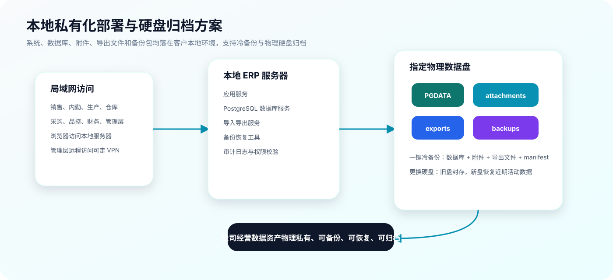

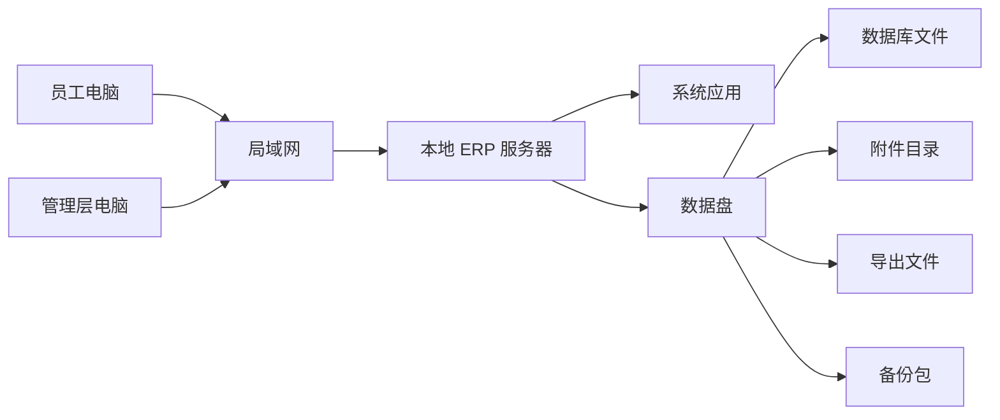

可选远程访问：

- 管理层如需外部访问，建议通过 VPN 或内网穿透白名单方式。
- 不建议直接暴露公网端口。

### 7.2 数据盘设计

系统支持通过 `ERP_DATA_DIR` 指定数据根目录。

建议目录结构：

```text
ERP_DATA_DIR/
  postgres/
  attachments/
  exports/
  backups/
```

这样数据库数据目录、附件、导出文件和备份包都位于指定物理数据盘，便于迁移和归档。正式部署时，PostgreSQL 的数据目录、备份目录和应用文件目录应按客户 IT 管理规范分配权限。

### 7.3 冷备份方案

管理员可在系统中生成完整冷备份包。

备份包包含：

- 数据库备份。
- 附件目录。
- 导出文件目录。
- manifest 说明文件。
- 备份时间和操作人。
- 恢复命令说明。

恢复命令示例：

```bash
npm run restore -- <backup.zip>
```

### 7.4 硬盘归档方案

客户明确提出，未来 2 到 4 年后可能更换硬盘，并将旧硬盘作为公司经营数据资产封存。

本系统支持这种管理方式：

- 数据集中保存在指定数据盘。
- 备份包可定期生成。
- 更换硬盘前生成完整冷备份。
- 旧硬盘可拔下作为历史资产归档。
- 新硬盘可通过恢复脚本重建系统数据。

## 8. 安全与权限方案

### 8.1 RBAC 角色权限

系统采用基于角色的权限控制。

主要角色：

- 销售员。
- 商务内勤。
- 生产主管/操作员。
- 仓库管理员。
- 采购员。
- 品控员。
- 财务专员。
- 管理层。
- 系统管理员。

权限原则：

- 专人专岗。
- 员工只看到自己相关待办。
- 关键业务动作必须校验角色。
- 管理层可查看全局数据。
- 财务拥有数据导出和收付款登记权限。
- 管理员负责系统配置和备份。

### 8.2 操作留痕

以下动作必须记录审计日志：

- 报价确认。
- 报价转订单。
- 生产指令下发。
- 排产记录。
- BOM 导入。
- 领料单生成。
- 原材料发料。
- 手动批次调整。
- 替代料发料。
- 请验发起。
- 质检判定。
- 成品入库。
- 发货。
- 采购入库。
- 应收回款。
- 应付付款。
- OA 审批发起、同意、驳回。
- 授权配方试算。
- 单据导出。
- 数据备份。
- 用户权限变更。

### 8.3 数据安全

安全策略：

- 本地账号登录。
- 密码加密存储。
- 服务端校验权限。
- 写操作使用事务。
- 数据导出权限受控。
- 管理员操作留痕。
- 数据文件不进入公网云。
- 可按客户 IT 要求增加内网访问白名单。

### 8.4 业务一致性

系统应保证以下一致性：

- 库存不足不能出库。
- 不合格质检结果不能入库。
- 已发货订单不能重复发货。
- 已结清应收应付不能重复收付款。
- 重复点击按钮不得生成重复关键单据。
- 采购入库、库存更新、应付生成应在同一事务中完成。

## 9. 实施计划

### 9.1 阶段一：功能确认版交付

目标：

- 交付一个可运行的功能确认版，让客户确认产品方向、界面形态、核心流程、关键算法和单据逻辑。

交付物：

- 可运行功能确认版系统。
- 角色工作台。
- 订单主线流程。
- 采购入库与移动均价验证。
- 质检收率验证。
- 应收应付验证。
- OA 审批验证。
- 授权配方算价验证。
- 本地归档验证。

客户需要确认：

- 流程是否贴近真实经营。
- 菜单和工作台是否容易理解。
- 报价、BOM、收率、配方算价公式是否符合业务习惯。

### 9.2 阶段二：真实资料导入与小范围试运行

目标：

- 用客户真实基础资料和少量真实业务进行小范围试运行，验证系统在实际业务中的适配程度。

交付物：

- 客户资料导入。
- 供应商资料导入。
- 原材料资料导入。
- 产品资料导入。
- BOM/配方导入。
- 单据模板整理。
- 真实角色账号配置。
- 试运行数据备份机制。

建议范围：

- 选择 1 到 2 类典型产品。
- 选择少量客户和供应商。
- 覆盖销售、内勤、生产、仓库、品控、采购、财务、管理层各 1 名关键用户。

### 9.3 阶段三：正式上线

目标：

- 将系统作为客户日常经营流程的主系统使用。

交付物：

- 正式服务器部署。
- 数据盘配置。
- 正式账号和权限。
- 正式单据模板。
- 真实报表导出。
- 备份恢复演练。
- 用户培训。
- 上线支持。

上线要求：

- 新订单必须进入系统。
- 仓库出入库必须通过系统记录。
- 质检判定必须在线留痕。
- 发货后应收和采购入库后应付由系统生成。

### 9.4 阶段四：优化扩展

目标：

- 根据真实使用反馈继续增强。

可能扩展：

- 更完整的基础资料维护后台。
- 更丰富的单据模板。
- 不合格品处理流程。
- 采购审批。
- 库存盘点。
- 条码扫码。
- 企业微信通知。
- 更细的成本分析。
- 数据库性能优化与高可用增强。

## 10. 验收标准

### 10.1 流程验收

- 能从报价开始跑通订单交付全流程。
- 能从采购订单跑通采购入库、库存更新、应付生成。
- 能从生产完工跑通请验、质检、入库。
- 能从发货跑通应收生成和回款登记。
- 能发起和审批简单 OA 事项。
- 能进行授权配方算价并保存历史。

### 10.2 数据验收

- 库存数量正确。
- 批次扣减正确。
- 移动加权平均成本正确。
- BOM 展开和领料数量正确。
- FIFO 分配正确。
- 收率计算正确。
- 应收应付余额正确。
- 配方试算价格来自当前原材料均价。
- 报表数据与业务单据一致。

### 10.3 权限验收

- 销售不能执行仓库发料。
- 仓库不能执行质检判定。
- 财务不能修改生产数据。
- 普通员工不能查看敏感配方成本。
- 管理层能查看全局数据。
- 管理员能执行备份和系统配置。

### 10.4 性能验收

- 普通单据操作响应时间目标约 1 秒。
- 库存和成本更新后页面可及时刷新。
- 管理看板可实时反映主要经营数据。
- 内部低并发场景下系统运行稳定。

### 10.5 部署验收

- 系统可在客户本地服务器运行。
- 局域网电脑可访问。
- 数据库和附件写入指定数据盘。
- 管理员可查看数据盘路径。
- 管理员可生成冷备份包。
- 备份包可在测试目录恢复。

### 10.6 报表验收

- 报价单可导出。
- 送货单可导出。
- 销售对账单可导出。
- 采购对账单可导出。
- 应收应付台账可导出。
- 库存日报、经营周报、经营月报可导出。
- 导出文件可被 Excel/WPS 打开。

## 11. 风险与边界

### 11.1 首期不建议纳入的范围

为保证项目可控，首期不建议纳入以下内容：

- 复杂自动排产算法。
- 复杂 OA 流程引擎。
- 直接对接用友/金蝶。
- 银行流水自动对账。
- 手机 App。
- 多公司集团化核算。
- 大规模高并发架构。
- 公网云 SaaS 化部署。

### 11.2 主要风险与控制方式

| 风险 | 表现 | 控制方式 |
| --- | --- | --- |
| 真实业务细节未完全确认 | 上线后流程需要调整 | 先交付功能确认版，再选典型产品和关键用户进行小范围试运行 |
| 基础资料不规范 | 物料、客户、供应商编码混乱 | 上线前整理基础资料模板 |
| 单据模板变化较多 | 导出格式反复调整 | 首期先固定常用模板，后续逐步扩展 |
| 用户不习惯线上流转 | 仍旧线下沟通、事后补录 | 工作台待办驱动，关键节点必须线上操作 |
| 数据安全责任不清 | 备份不及时或硬盘管理混乱 | 明确管理员职责，建立备份和归档制度 |

### 11.3 边界说明

系统首期重点是把客户真实经营流程线上化、结构化和可追溯化。它不是替代所有企业软件，也不是一次性建设大型 ERP 平台。

建议遵循“先功能确认、再小范围试运行、关键流程跑通后正式上线”的原则。

## 12. 采购建议

### 12.1 是否适合采购

本项目适合采购建设。

原因如下：

- 客户需求清晰，核心主线围绕销售订单，具备定制开发落地条件。
- 当前痛点集中在库存、成本、生产流转、质检、收付款和报表，系统建设价值明确。
- 通用 ERP 模块重、流程固化，难以完全贴合客户当前经营方式。
- 客户明确要求本地化和数据物理私有，轻量定制方案更符合要求。
- 核心算法明确，包括移动加权平均、BOM 展开、FIFO、收率、配方算价，技术可实现。
- 可先交付功能确认版作为采购评审、流程确认和小范围试运行基础。

### 12.2 推荐采购方式

建议采用分阶段采购或分阶段实施方式：

1. 先确认正式方案和功能确认版。
2. 再进入真实资料导入与小范围试运行。
3. 试运行通过后进入正式上线。
4. 上线后按实际使用反馈持续优化。

这种方式比一次性采购完整大系统更稳妥，也更符合客户“不要冗余固化模块、要贴合自身流程”的要求。

### 12.3 决策关注点

采购评审时建议重点关注：

- 系统是否贴合客户真实订单流转。
- 是否能替代关键 Excel 计算。
- 是否能保证库存、成本、批次和收率可信。
- 是否能满足本地部署和硬盘归档要求。
- 是否能让员工快速上手。
- 是否能在后续按客户真实流程继续定制。

### 12.4 总体建议

建议客户将本项目作为企业内部轻量 ERP 的定制化建设项目推进。项目不应简单按通用软件采购逻辑评估，而应按“业务流程定制 + 本地私有化部署 + 关键经营数据沉淀”的价值进行判断。

系统上线后的核心价值，不是多一个软件，而是让客户每天最关心的问题可以被系统直接回答：

- 订单现在走到哪一步？
- 料有没有领？
- 仓库出了哪个批次？
- 当前库存和成本是多少？
- 产品检验是否合格？
- 这批生产收率是多少？
- 货有没有发？
- 客户钱收了多少？
- 供应商钱还欠多少？
- 当前原材料价格下，这个配方应该卖多少钱？
- 这些经营数据是否都在客户自己的硬盘里？

当这些问题不再依赖电话、微信和 Excel，而是由系统自然沉淀和实时呈现，本项目就具备明确的采购价值和长期使用价值。
