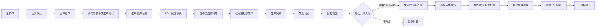
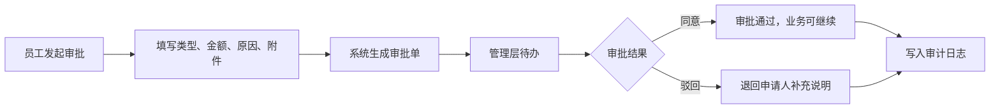

# 轻量级定制生产流转 ERP 正式上线 PRD

版本：V1.0  
整理日期：2026-04-28  
适用对象：客户方管理层、业务负责人、生产/仓储/财务/品控负责人、实施与研发团队  
项目定位：围绕客户订单主线的本地化轻量 ERP 系统  

## 1. 项目背景

客户当前的经营流程已经具备清晰的业务主线：从报价开始，到客户下单，再到内勤下发生产、生产排产、领料、仓库出库、质检、入库、发货、对账、收付款，最终形成经营报表。

这条主线现在主要依赖人工沟通、Excel 计算、纸质单据和部门之间的口头确认。短期看，这种方式灵活；长期看，它会带来几个核心问题：

- 订单进展不透明，老板和内勤需要反复询问才知道生产、仓库、质检卡在哪一步。
- 原材料库存和采购价格变化后，库存均价、订单成本、报价依据需要人工反复计算。
- 生产领料、批次出库、替代料使用、收率损耗缺少统一留痕。
- 发货后应收、采购入库后应付、对账单和送货单依赖人工整理，容易滞后。
- 经营日报、周报、月报的数据散落在不同人员手里，管理层无法实时看见。
- 通用 ERP 如金蝶、用友模块固化、账号和流程限制较多，不能很好贴合客户现有经营习惯。
- 客户明确要求系统必须本地部署，不上云，数据资产要能随硬盘物理归档保存。

因此，本项目不是要做一套庞大的传统 ERP，而是做一套贴合客户实际经营方式的“轻量级定制生产流转引擎”。它的价值不在于模块多，而在于把客户真正每天发生的事情在线化、结构化、可追踪、可计算。

## 2. 产品愿景

让一张客户订单成为系统里的唯一主线。

销售看到报价和客户订单，内勤看到待下发和待发货，生产看到待排产和待领料，仓库看到待发料和待入库，品控看到待检验，财务看到应收应付，管理层看到实时经营状态。每个人只看自己该处理的事，每一步都能留下证据，每一次库存和成本变化都能自动计算。

最终系统要达到三个结果：

1. 业务闭环  
   从报价到交付的每个节点都有线上单据、责任人、时间、状态和结果。

2. 数据可信  
   库存、批次、成本、收率、应收、应付、报表数据来自业务动作本身，而不是事后人工补表。

3. 资产私有  
   数据库、附件、导出文件、备份包全部保存在客户本地服务器指定硬盘中。硬盘可更换、可封存、可归档。

## 3. 项目目标

### 3.1 业务目标

- 建立以销售订单为主线的全流程线上化系统。
- 替代关键 Excel 人工计算，包括报价成本、移动加权均价、领料需求、生产收率。
- 实现原材料、成品、过渡料、边角料的实时库存管理。
- 实现采购、应付、销售、应收的数据闭环。
- 支持客户常用单据导出，包括报价单、送货单、销售对账单、采购对账单、应收应付台账、库存日报、经营周报、经营月报。
- 为管理层提供实时看板，减少跨部门反复追问。

### 3.2 管理目标

- 所有关键节点专人专岗，操作留痕。
- 每张单据有状态、有来源、有去向。
- 每一次库存出入库有批次、有成本、有经办人。
- 每一次质检判定能追溯到生产批次和入库结果。
- 每一笔应收应付能追踪收付款进度。

### 3.3 技术目标

- 系统本地化部署在客户局域网服务器。
- 低并发场景下，普通业务操作响应时间控制在 1 秒左右。
- 数据库和附件统一落在指定数据盘。
- 支持一键冷备份和恢复脚本。
- 系统架构保持轻量，便于后续按客户真实流程继续定制。

## 4. 目标用户与角色权限

系统采用基于角色的权限控制。正式上线后每个用户绑定一个或多个角色，系统根据角色展示待办、可操作按钮和可查看数据范围。

### 4.1 销售员

核心职责：

- 维护客户报价。
- 根据规则生成报价单。
- 将客户确认的报价转为正式客户订单。
- 查看自己负责客户的订单进度。

重点页面：

- 报价单
- 客户订单
- 报价历史版本
- 客户交付状态

核心权限：

- 新建/编辑报价单。
- 确认报价。
- 发起订单。
- 导出报价单。

### 4.2 商务内勤

核心职责：

- 接收客户订单。
- 向生产部门下发生产指令。
- 跟踪生产、质检、入库进展。
- 成品入库后安排发货。
- 生成送货单、销售对账单。

重点页面：

- 待下发订单
- 生产指令单
- 待发货订单
- 发货单
- 销售对账单

核心权限：

- 生成生产指令。
- 查看订单全链路状态。
- 创建发货单。
- 导出送货单和销售对账单。

### 4.3 生产操作员/生产主管

核心职责：

- 接收生产指令。
- 人工排产并在系统中记录计划。
- 录入或导入 BOM/配方。
- 根据排产数量生成领料单。
- 生产完成后发起请验。

重点页面：

- 生产指令
- 排产记录
- BOM 管理
- 领料单
- 请验单

核心权限：

- 记录计划生产日期、机台、负责人。
- 导入/维护 BOM。
- 生成领料单。
- 发起请验。

说明：客户明确表示排产可以人工完成，系统不需要自动优化排产。但系统必须记录排产证据，保证订单后续可追踪。

### 4.4 仓库管理员

核心职责：

- 根据领料单完成原材料出库。
- 管理原材料批次。
- 处理采购入库。
- 处理成品、过渡料、边角料入库。
- 参与库存盘点。

重点页面：

- 待发料单
- 原材料批次
- 采购入库
- 待入库成品
- 库存预警
- 库存流水

核心权限：

- 按 FIFO 先进先出发料。
- 手动指定出库批次。
- 使用预设替代料发料。
- 确认采购入库。
- 确认成品/过渡料入库。
- 导出库存日报。

### 4.5 品控员

核心职责：

- 接收生产请验单。
- 录入检验结果。
- 判定产品是否合格、让步接收或不合格。
- 决定是否允许进入入库环节。

重点页面：

- 待检验单
- 检验结果
- 不合格记录
- 收率趋势

核心权限：

- 录入实测数据。
- 录入最终判定。
- 上传检验附件。
- 查看质检历史。

关键规则：

- 只有判定为“合格”或“让步接收”的批次才能进入仓库入库。
- 判定为“不合格”的批次需要进入异常处理流程，不能直接入库。

### 4.6 采购员

核心职责：

- 维护供应商信息。
- 根据库存预警和生产需求创建采购订单。
- 录入采购价格。
- 采购到货后推动入库。
- 跟踪供应商应付情况。

重点页面：

- 供应商台账
- 采购订单
- 待采购物料
- 待入库采购单
- 应付摘要

核心权限：

- 新建采购订单。
- 查看低库存提醒。
- 查看采购价格历史。
- 查看供应商台账。

### 4.7 财务专员

核心职责：

- 查看应收应付。
- 登记客户回款。
- 登记供应商付款。
- 导出财务原始数据，用于导入用友/金蝶或财务内部处理。

重点页面：

- 应收台账
- 应付台账
- 回款记录
- 付款记录
- 财务数据提取台

核心权限：

- 导出财务数据。
- 登记收款。
- 登记付款。
- 查看账龄和余额。

说明：客户明确表示系统不需要直接对接财务软件。财务需要数据时，从系统中调取明细即可。

### 4.8 管理层

核心职责：

- 查看经营全局。
- 查看订单、生产、库存、采购、收付款、收率等实时数据。
- 下载日报、周报、月报。

重点页面：

- 经营总览
- 订单金额
- 生产进度
- 库存价值
- 应收应付余额
- 收率趋势
- 库存预警

核心权限：

- 查看所有数据。
- 导出管理报表。
- 查看审计日志摘要。

### 4.9 系统管理员

核心职责：

- 用户和权限配置。
- 基础资料配置。
- 数据备份。
- 本地服务器和数据盘归档管理。

重点页面：

- 用户管理
- 权限配置
- 系统参数
- 本地归档
- 备份恢复
- 审计日志

核心权限：

- 分配角色。
- 配置基础资料。
- 生成冷备份包。
- 查看数据盘路径、数据库大小、附件大小和最近备份。

## 5. 核心业务主流程

正式上线系统的核心流程如下：



这条流程必须做到：

- 每一步都有单据。
- 每一步都有状态。
- 每一步都有责任人。
- 每一步都能回看历史。
- 每一步的数据能自动影响后续库存、成本、收率、应收和报表。

## 6. 功能需求

### 6.1 销售与报价模块

#### 6.1.1 客户管理

功能说明：

- 维护客户名称、联系人、电话、地址、开票信息、备注。
- 支持查看客户历史报价和历史订单。

上线要求：

- 客户资料可新增、编辑、停用。
- 停用客户不可再新建订单，但历史数据可查。

#### 6.1.2 报价单管理

功能说明：

- 销售员根据客户需求创建报价单。
- 报价单包含客户、产品、数量、单位、交期、特殊要求、报价版本、报价状态。
- 系统按预设规则生成报价。

报价逻辑：

```text
报价基础成本 = BOM 对应物料需求量 × 当前移动加权平均成本
报价金额 = 报价基础成本 + 加工费 + 利润
利润 = (报价基础成本 + 加工费) × 利润率
```

需求细节：

- 支持报价单版本管理。
- 支持报价单确认。
- 已确认报价可以转为正式客户订单。
- 支持导出报价单。
- 报价单确认后原则上不可直接修改，应通过新版本处理。

验收标准：

- 销售员能在 3 分钟内生成一张报价单。
- 报价单能显示成本依据、加工费、利润率和最终报价。
- 报价单能导出为 Excel/PDF 格式。

#### 6.1.3 客户订单

功能说明：

- 已确认报价单可一键转客户订单。
- 订单包含客户、产品、数量、交付期限、特殊要求、来源报价单。

订单状态建议：

- 待下发
- 已下发生产
- 生产中
- 待质检
- 待入库
- 待发货
- 已发货
- 已完成
- 已取消

验收标准：

- 每张订单能看到完整流转进度。
- 管理层能按客户、月份、产品查看订单金额。

### 6.2 商务内勤模块

#### 6.2.1 生产指令下发

功能说明：

- 商务内勤选择客户订单，生成生产指令单。
- 生产指令单推送给生产部门。

生产指令单字段：

- 指令单号
- 来源订单
- 客户名称
- 产品名称
- 订单数量
- 交付期限
- 特殊要求
- 下发人
- 下发时间

验收标准：

- 未下发订单在内勤待办中显示。
- 下发后生产部门待办出现生产指令。
- 操作写入审计日志。

#### 6.2.2 发货与单据

功能说明：

- 成品入库后，商务内勤安排发货。
- 系统生成发货单、送货单。
- 发货后自动生成应收账款。

需要支持的单据：

- 发货单
- 送货单
- 销售对账单

验收标准：

- 已入库订单才能发货。
- 发货后应收账款自动生成。
- 送货单和销售对账单可导出。

### 6.3 生产执行模块

#### 6.3.1 排产记录

功能说明：

- 生产部门接收生产指令后，人工决定排产计划。
- 系统只记录排产证据，不做复杂自动排产。

排产字段：

- 计划生产日期
- 机台
- 负责人
- 班组
- 备注

验收标准：

- 每张生产指令必须有排产记录后才能生成领料单。
- 管理层能看到订单生产状态。

#### 6.3.2 BOM/配方管理

功能说明：

- 支持多级 BOM。
- 支持页面录入。
- 支持 Excel 模板导入。
- 支持标记主材，用于收率计算。

BOM 字段：

- 产品
- 版本
- 组件类型：原材料/半成品/产品
- 组件名称
- 单位用量
- 是否主材
- 损耗系数
- 状态

验收标准：

- 一个产品可维护多个 BOM 版本。
- 系统能递归展开多级 BOM。
- 系统能按订单数量汇总原材料需求。

#### 6.3.3 领料单自动生成

功能说明：

- 排产后，系统根据订单数量和 BOM 自动生成领料单。
- 领料单包含原材料种类、需求数量、单位、是否主材。

验收标准：

- 领料数量计算准确。
- 领料单状态可从待发料变为已发料。
- 仓库按领料单发料后库存实时减少。

### 6.4 仓储库存模块

#### 6.4.1 原材料批次管理

功能说明：

- 每次采购入库形成一个或多个原材料批次。
- 批次包含批次号、数量、单位成本、供应商、入库时间。

验收标准：

- 每一批原材料可追溯来源。
- 库存汇总数量与批次数量合计一致。

#### 6.4.2 FIFO 发料

功能说明：

- 仓库按领料单发料。
- 系统默认按最早入库批次进行 FIFO 分配。
- 若库存不足，系统提示缺口。

验收标准：

- 默认发料批次符合先进先出。
- 发料后对应批次数量减少。
- 发料后物料总库存减少。
- 出库流水记录批次、数量、成本和来源领料单。

#### 6.4.3 手动批次与替代料

功能说明：

- 特殊测试要求或客户指定要求下，仓库可人工选择指定批次。
- 若物料存在预设替代关系，可选择替代料发料。

上线要求：

- 手动改批次必须填写原因。
- 替代料必须来自预设替代关系。
- 替代料发料必须写入审计日志。

#### 6.4.4 成品、过渡料、边角料入库

功能说明：

- 品控放行后，仓库或生产办理入库。
- 支持标准成品入库。
- 支持过渡料/边角料入库。
- 过渡料需记录来源生产批次。

验收标准：

- 未通过品控的批次不能入库。
- 入库后库存和报表实时刷新。

### 6.5 采购与供应商模块

#### 6.5.1 供应商台账

功能说明：

- 维护供应商名称、联系人、电话、付款条件、供应物料、状态。
- 查看供应商采购历史和应付余额。

验收标准：

- 供应商可新增、编辑、停用。
- 停用供应商不能创建新采购订单。

#### 6.5.2 采购订单

功能说明：

- 采购员根据库存预警或业务需求创建采购订单。
- 采购订单包含供应商、物料、数量、单价、金额、预计到货日。

状态建议：

- 待入库
- 已入库
- 已取消

验收标准：

- 采购订单入库后生成库存批次。
- 采购订单入库后生成应付账款。

#### 6.5.3 采购入库与移动加权平均

功能说明：

- 每次采购入库后，系统自动更新该物料移动加权平均成本。

计算公式：

```text
新库存均价 = (原库存数量 × 原库存均价 + 本次入库数量 × 本次采购单价)
          ÷ (原库存数量 + 本次入库数量)
```

验收标准：

- 采购入库后自动生成批次。
- 采购入库后库存数量增加。
- 采购入库后移动加权平均成本正确更新。
- 出库不改变均价，只减少库存数量和批次数量。

### 6.6 品控与收率模块

#### 6.6.1 请验单

功能说明：

- 生产完成后发起请验。
- 品控部门收到待检验任务。

请验字段：

- 请验单号
- 来源生产单
- 产品
- 生产数量
- 请验时间
- 请验人

#### 6.6.2 检验判定

功能说明：

- 品控录入实测数据。
- 品控给出最终判定：合格、让步接收、不合格。

验收标准：

- 合格和让步接收允许入库。
- 不合格不允许入库。
- 判定结果写入审计日志。

#### 6.6.3 收率计算

功能说明：

- 成品入库时，系统根据实际入库量和主材实际领料量计算收率。

计算公式：

```text
收率 = 实际合格/让步入库量 ÷ 主材实际领料量 × 100%
```

同时展示：

- 计划完成率
- 生产损耗量
- 过渡料/边角料数量
- 收率趋势

验收标准：

- 每个生产批次都能看到收率。
- 管理层能按产品、月份查看收率趋势。

### 6.7 财务协同模块

#### 6.7.1 应收账款

功能说明：

- 发货单生成后自动生成应收账款。
- 财务可登记回款。
- 支持部分回款。
- 系统自动更新应收状态。

状态：

- 未收
- 部分回款
- 已收

验收标准：

- 应收余额 = 应收总额 - 已收金额。
- 回款后状态自动变化。
- 支持按客户、订单、时间段导出应收台账。

#### 6.7.2 应付账款

功能说明：

- 采购入库后自动生成应付账款。
- 财务可登记付款。
- 支持部分付款。
- 系统自动更新应付状态。

状态：

- 未付
- 部分付款
- 已付

验收标准：

- 应付余额 = 应付总额 - 已付金额。
- 付款后状态自动变化。
- 支持按供应商、采购单、时间段导出应付台账。

#### 6.7.3 财务数据提取台

功能说明：

- 财务可按时间段、订单、物料、客户、供应商导出明细。
- 导出数据供财务导入用友、金蝶或内部做账。

导出内容：

- 销售订单
- 发货明细
- 应收明细
- 回款记录
- 采购订单
- 应付明细
- 付款记录
- 库存出入库流水

### 6.8 报表与管理看板

#### 6.8.1 管理层 Dashboard

核心指标：

- 今日/本月订单金额
- 采购金额
- 应收余额
- 应付余额
- 已回款金额
- 库存总价值
- 低库存预警数量
- 生产进度
- 发货进度
- 平均收率

图表：

- 订单流转柱状图
- 生产进度图
- 库存价值图
- 应收应付对比图
- 收率趋势图

验收标准：

- 管理层登录后默认进入经营总览。
- 关键经营数据来自系统业务单据实时汇总。

#### 6.8.2 日报、周报、月报

功能说明：

- 系统支持导出库存日报、经营周报、经营月报。
- 报表按固定模板输出。

正式上线增强：

- 支持客户上传公司 Logo。
- 支持配置报表抬头、页脚、制表人。
- 支持公司固定 Excel 模板填充。

### 6.9 简单办公 OA 审批

客户新增需求中提出，希望系统能够承担一部分简单办公审批能力。该能力不需要做成复杂 OA 平台，而应围绕企业日常经营中最常见、最需要留痕的审批事项，为管理层提供一个轻量、清晰、可追溯的审批入口。

#### 6.9.1 审批定位

系统内的 OA 审批主要解决三类问题：

- 业务动作需要授权，例如特采、替代料、超额采购、让步接收。
- 日常办公事项需要留痕，例如费用报销、维修申请、临时采购、请假外出。
- 管理层需要快速知道哪些事项正在等待自己同意。

该模块的原则是“轻审批、强留痕”。不追求复杂流程设计器，首期以固定模板和固定审批人为主，满足客户真实使用中最常见的审批需求。

#### 6.9.2 审批类型

首期建议支持：

- 采购特采审批
- 替代料使用审批
- 让步接收审批
- 费用报销审批
- 设备维修审批
- 日常办公申请

后续可扩展：

- 请假审批
- 付款审批
- 合同用印审批
- 超预算审批

#### 6.9.3 审批流程



#### 6.9.4 审批字段

- 审批单号
- 审批类型
- 标题
- 申请人
- 申请部门
- 金额
- 原因说明
- 附件
- 状态：待审批、已同意、已驳回、已撤回
- 审批人
- 审批时间
- 审批意见

#### 6.9.5 权限要求

- 普通员工可发起与自己岗位相关的审批。
- 管理层和系统管理员可审批。
- 财务可查看与费用、付款相关审批。
- 审批通过后，相关业务动作可继续流转。
- 审批驳回后，业务动作不得继续执行。

#### 6.9.6 验收标准

- 员工能在系统中发起一张审批单。
- 管理层登录后能在待办中看到待审批事项。
- 管理层可同意或驳回审批。
- 审批结果可在审批台账中查看。
- 审批操作写入审计日志。

### 6.10 授权配方价格试算

这是客户新增需求中非常重要的一项能力，也是系统区别于普通进销存软件的关键价值点。

客户的业务场景是：采购部门不断录入原材料采购价，系统已经自动形成每种原材料的当前移动加权平均成本。公司授权的少数人员希望在系统中输入一个配方，也就是若干种已有原材料的组成配比，系统自动按照公式计算出该配方的价格。这样每次不再需要人工打开 Excel 重新查价格、复制公式、反复计算，系统可以直接给出可信的配方成本和建议报价，并保存历史试算记录。

#### 6.10.1 功能目标

- 授权人员可选择系统已有原材料并输入组成配比。
- 系统自动读取每种原材料当前移动加权平均成本。
- 系统按固定公式计算配方材料成本、损耗成本、加工费、利润和建议价格。
- 每一次试算都保存为一张配方试算单。
- 管理层可以统计总共试算过多少个配方。
- 可查看每个配方的组成明细、当时均价、成本贡献和试算人。

#### 6.10.2 授权人员

首期建议允许以下角色使用：

- 管理层
- 系统管理员
- 采购负责人
- 生产负责人
- 经授权的销售负责人

权限原则：

- 普通员工不能随意查看和试算配方价格。
- 授权人员只能基于系统已有原材料选择配方组成。
- 每次试算必须记录试算人和试算时间。
- 试算结果可作为报价参考，但正式报价仍需走报价单确认流程。

#### 6.10.3 计算逻辑

基础公式：

```text
单个配方材料成本 = Σ(原材料配比用量 × 当前移动加权平均成本)
含损耗材料成本 = 单个配方材料成本 × (1 + 损耗率)
配方成本 = 含损耗材料成本 + 加工费
建议销售单价 = 配方成本 × (1 + 利润率)
批量试算金额 = 建议销售单价 × 试算数量
```

示例：

```text
配方 A：
42CrMo 圆钢 1 kg
防锈涂层液 0.04 L
周转包装 0.1 套

系统读取：
42CrMo 圆钢当前均价
防锈涂层液当前均价
周转包装当前均价

系统自动输出：
材料成本
损耗后材料成本
加工费
利润率
建议单价
100 件试算总价
```

#### 6.10.4 试算记录

每次配方试算需要保存：

- 试算单号
- 配方名称
- 试算数量
- 单位
- 原材料明细
- 配比用量
- 当时移动均价
- 单项成本贡献
- 成本占比
- 材料成本
- 损耗率
- 加工费
- 利润率
- 建议单价
- 批量试算金额
- 试算人
- 试算时间
- 备注

#### 6.10.5 与采购价格联动

该功能必须与采购入库和移动加权平均成本联动：

- 采购录入新价格并入库后，系统更新原材料移动均价。
- 授权人员再次试算同一配方时，系统使用新的移动均价。
- 历史试算记录保留当时的均价和成本，不随之后价格变化而改写。

这点对客户非常关键。它让系统不仅能回答“现在这个配方多少钱”，也能回答“当时为什么按这个价格报价”。

#### 6.10.6 统计与看板

管理层需要看到：

- 总共试算了多少个配方。
- 最近一次试算价格。
- 哪些人员做过试算。
- 哪些原材料对成本影响最大。
- 采购价格变化后，配方价格是否明显波动。

#### 6.10.7 验收标准

- 授权人员能点击“试算配方”生成一条真实试算记录。
- 试算价格来自当前原材料移动均价。
- 采购入库改变均价后，再试算能得到新的价格。
- 系统能展示配方试算历史和试算次数。
- 每次试算写入审计日志。

### 6.11 本地归档与备份恢复

#### 6.11.1 本地部署

客户明确要求：

- 不使用公网云数据库。
- 不使用云存储保存业务数据。
- 系统部署在客户本地服务器。
- 内网访问，必要时通过 VPN 供高管远程访问。

上线要求：

- 数据库文件和附件目录放在指定数据盘。
- 系统配置支持指定数据根目录。
- 数据盘路径在管理员页面可见。

#### 6.11.2 冷备份

功能说明：

- 管理员可一键生成冷备份包。
- 备份包包含数据库、附件、导出文件、manifest 文件。

备份包内容：

- SQLite/PostgreSQL 数据库备份
- 上传附件
- 导出单据
- 系统配置摘要
- 备份时间
- 备份操作人
- 恢复说明

验收标准：

- 管理员能下载备份包。
- 备份包能在干净数据目录恢复。
- 恢复后系统可启动并读取近期数据。

#### 6.11.3 硬盘归档

业务目标：

当客户 2 到 4 年后更换数据硬盘时，可以将旧硬盘取下，作为公司历史经营数据资产物理封存。新硬盘插入后，通过恢复脚本恢复基础系统和近期活动数据。

管理员页面需要展示：

- 当前数据盘路径
- 数据库大小
- 附件大小
- 导出文件大小
- 备份包大小
- 最近备份时间
- 恢复命令
- 硬盘归档说明

## 7. 数据对象

正式系统至少包含以下数据对象：

- 用户
- 角色
- 权限
- 客户
- 供应商
- 产品
- 原材料
- 替代料关系
- 原材料批次
- BOM
- BOM 明细
- 报价单
- 客户订单
- 生产指令单
- 排产记录
- 领料单
- 领料明细
- 批次发料记录
- 库存流水
- 请验单
- 检验记录
- 成品批次
- 过渡料/边角料记录
- 发货单
- 应收账款
- 回款记录
- 采购订单
- 采购入库
- 应付账款
- 付款记录
- OA 审批单
- 审批流转记录
- 配方试算单
- 配方试算明细
- 导出记录
- 报表快照
- 审计日志
- 备份记录

## 8. 权限与审计要求

### 8.1 权限原则

- 员工只看到自己岗位相关待办。
- 关键动作必须校验角色。
- 管理层拥有全局查看权限。
- 财务只需要数据导出和收付款登记权限。
- 系统管理员负责基础配置和备份恢复。

### 8.2 审计日志

以下动作必须写入审计日志：

- 报价确认
- 报价转订单
- 生产指令下发
- 排产记录
- BOM 导入
- 领料单生成
- 原材料发料
- 手动改批次
- 替代料发料
- 请验发起
- 质检判定
- 成品入库
- 发货
- 采购入库
- 应收回款
- 应付付款
- 单据导出
- 数据备份
- 用户权限变更
- OA 审批发起
- OA 审批同意/驳回
- 授权配方试算
- 配方试算导出

日志字段：

- 操作人
- 操作时间
- 操作类型
- 单据类型
- 单据编号
- 操作前状态
- 操作后状态
- 备注

## 9. UI/UX 要求

客户不希望使用传统 ERP 那种复杂、密集、固化的菜单系统。正式系统界面应遵循以下原则：

- 登录后默认进入工作台。
- 工作台优先显示“我需要处理什么”。
- 左侧保留简洁模块导航。
- 每个角色只突出自己的待办任务。
- 每个模块采用“指标摘要 + 表格 + 操作按钮”的商用 ERP 样式。
- 避免过多弹窗和复杂层级。
- 单据状态要清晰，用颜色和标签区分。
- 宽表格支持横向滚动，不破坏页面布局。
- 支持大屏管理看板。

推荐导航：

- 经营总览
- 销售订单
- 生产执行
- 采购仓储
- 质检收率
- 财务台账
- 审批算价
- 本地归档
- 系统设置

## 10. 非功能需求

### 10.1 性能

- 内部低并发使用，优先保证稳定和响应。
- 普通单据流转响应时间目标小于 1 秒。
- 库存和成本更新应在操作成功后立即刷新。
- 管理看板数据刷新延迟目标小于 1 秒。

### 10.2 稳定性

- 所有库存和财务相关写操作必须使用事务。
- 单据状态不允许越级流转。
- 库存不足时禁止出库。
- 不合格质检批次禁止入库。
- 重复点击按钮不得生成重复关键单据。

### 10.3 安全

- 本地账号登录。
- 密码加密存储。
- 角色权限控制。
- 关键接口校验身份和角色。
- 数据导出权限受控。
- 管理员操作写审计日志。
- 可配置局域网访问白名单。

### 10.4 私有化

- 数据不上传公网云。
- 数据库和附件路径可配置。
- 支持离线局域网运行。
- 支持本地备份与恢复。

## 11. 上线阶段规划

### 阶段一：客户演示与流程确认

目标：

- 用可运行 Demo 向客户演示完整订单主线。
- 确认客户是否认可系统形态。
- 收集真实单据模板和字段。

交付：

- 演示系统
- 角色工作台
- 订单主流程
- 采购/应付支线
- 发货/应收支线
- 管理看板
- 本地归档展示

### 阶段二：试点上线

目标：

- 用客户真实基础资料跑一个小范围试点。
- 先选 1 到 2 类产品、少量客户、少量供应商。
- 让销售、内勤、生产、仓库、品控、财务各有 1 名关键用户参与。

交付：

- 客户/供应商/物料/产品基础资料维护
- 真实 BOM
- 真实报价规则
- 真实单据模板
- 真实权限账号
- 试点数据备份机制

### 阶段三：正式上线

目标：

- 覆盖主要订单流程。
- 财务、仓库、生产、内勤全部使用系统处理关键节点。
- 管理层通过看板查看实时经营数据。

交付：

- 正式服务器部署
- 数据盘配置
- 用户培训
- 历史基础数据导入
- 备份恢复演练
- 上线支持

### 阶段四：持续优化

目标：

- 根据真实使用反馈优化页面和流程。
- 增加更细的报表、审批、异常处理、盘点功能。

可能增强：

- 客户自定义报表模板
- 不合格品处理流程
- 采购审批
- 库存盘点
- 条码扫码
- 合同和附件归档
- 更细成本分析

## 12. 验收标准

### 12.1 流程验收

- 能从报价单开始跑完整订单交付流程。
- 能完成采购入库并生成应付。
- 能完成发货并生成应收。
- 能登记付款和回款。
- 能查看完整订单链路。

### 12.2 数据验收

- 库存数量正确。
- 批次扣减正确。
- 移动加权平均成本正确。
- 收率计算正确。
- 应收应付余额正确。
- 报表数据与业务单据一致。

### 12.3 权限验收

- 销售不能处理仓库发料。
- 仓库不能做质检判定。
- 财务不能修改生产数据。
- 管理层能查看全部经营数据。
- 管理员能备份和查看审计日志。

### 12.4 部署验收

- 系统可在客户本地服务器运行。
- 客户内网电脑可访问。
- 数据写入指定数据盘。
- 能生成备份包。
- 能在测试目录恢复备份。

## 13. 不在首期范围内

为保证上线速度和贴合客户真实痛点，以下内容不建议作为首期核心范围：

- 复杂自动排产算法。
- 直接对接用友/金蝶。
- 银行流水自动对账。
- 手机 App。
- 多公司集团化核算。
- 复杂审批流引擎。
- 大规模高并发架构。
- 云端 SaaS 化运营。

这些能力可以后续根据客户真实使用情况逐步增加。

## 14. 需要客户进一步确认的问题

### 14.1 基础资料

- 产品清单有多少类？
- 原材料清单有多少种？
- 是否已有统一物料编码？
- BOM 是否已有 Excel 模板？
- 替代料规则是否固定？

### 14.2 单据模板

- 报价单模板。
- 送货单模板。
- 销售对账单模板。
- 采购对账单模板。
- 日报、周报、月报模板。
- 是否需要公司 Logo、盖章区、签字区。

### 14.3 流程规则

- 谁可以确认报价？
- 谁可以取消订单？
- 谁可以改发料批次？
- 不合格品如何处理？
- 让步接收是否需要审批？
- 采购订单是否需要审批？

### 14.4 财务规则

- 应收账期如何计算？
- 应付账期如何计算？
- 是否按客户生成对账单？
- 是否按订单生成对账单？
- 回款是否需要关联发票？

### 14.5 部署环境

- 客户本地服务器操作系统。
- 数据盘容量规划。
- 内网访问人数。
- 是否需要 VPN 远程访问。
- 备份频率要求。
- 是否需要异地离线备份。

### 14.6 OA 审批与配方算价

- 首期需要哪些审批类型？
- 哪些审批必须由管理层审批？
- 让步接收、替代料、超额采购是否必须走审批？
- 哪些人员属于“配方价格试算授权人员”？
- 配方试算公式中的损耗率、加工费、利润率是否按产品配置？
- 配方试算结果是否允许销售直接转报价单？
- 是否需要隐藏原材料成本，只显示建议报价？

## 15. 项目成功定义

这个系统上线成功，不是因为它像传统 ERP 一样拥有很多模块，而是因为客户每天真正关心的几个问题可以被系统直接回答：

- 这个订单现在走到哪一步了？
- 生产有没有排？
- 料有没有领？
- 仓库出了哪个批次？
- 原材料还剩多少？
- 这批料现在的平均成本是多少？
- 产品检验合不合格？
- 这批生产收率是多少？
- 成品有没有入库？
- 货有没有发？
- 客户钱收了多少？
- 供应商钱还欠多少？
- 哪些办公事项还在等审批？
- 当前原料价格下，这个配方到底应该卖多少钱？
- 公司一共试算过多少个配方，分别是谁算的？
- 今天公司订单、库存、生产和现金流是什么状态？
- 这些数据是不是都在我们自己的硬盘里？

当这些问题不再需要靠电话、微信和 Excel 反复追问，而是在系统中自然出现，这套轻量 ERP 就真正成为了客户的经营数据中枢。
